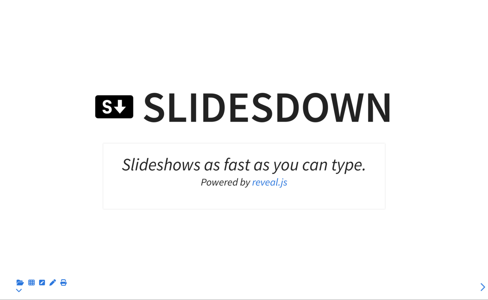

#  Slidesdown

Slideshows as fast as you can type.

[Slidesdown](https://slidesdown.github.io) is powered by the incredible
[reveal.js presentation framework](https://revealjs.com/).

[](https://slidesdown.github.io)

## Learn

Visit [slidesdown.github.io/learn.html](https://slidesdown.github.io/learn.html)
to get started.

## Usage: View Slides

### Online Viewer

Visit
[slidesdown.github.io/loader.html](https://slidesdown.github.io/loader.html) and
enter the URL to your Markdown presentation, e.g.
`github.com/slidesdown/slidesdown/SLIDES.md`.

### CLI

Slidesdown provides a CLI to quickly open files on your computer in the Online
Viewer or a viewer hosted in a local Docker container that can be used fully
offline (i.e. perfect for presentations you want to keep private).

#### Installation

```bash
sudo curl -L https://raw.githubusercontent.com/slidesdown/slidesdown/main/slidesdown -o /usr/local/bin/slidesdown; sudo chmod a+x /usr/local/bin/slidesdown
```

The following optional programs are used by `slidesdown`:

- [`nu`](https://nushell.sh) JSON and YAML parser.
- `gzip` to encode the presentaiton.
- `xdg-open`, [`open-cli`](https://github.com/sindresorhus/open-cli) or `open`
  (MacOS) for opening the slideshow in the default browser.
- [`docker`](https://www.docker.com/) required for offline presentations and
  hot-reloading slides while editing.
- [`python3`](https://www.python.org/) required for online presentations via
  [slidesdown.github.io](https://slidesdown.github.io) if the slideshow file
  shall be served from the local computer, i.e. useful for creating slides or
  when the presentation is private and shall not be made accessible publicly via
  GitHub.
- [`decktape`](https://github.com/astefanutti/decktape) or `docker` for
  exporting slideshows as PDF.
- [`cloudflared`](https://github.com/cloudflare/cloudflared) for making the
  presentation accessible on the internet via a
  [CloudFlare tunnel](https://developers.cloudflare.com/cloudflare-one/connections/connect-networks/get-started/create-local-tunnel/).

#### Update

```bash
sudo slidesdown -u
```

#### Open local file in slidesdown Online Viewer (python3 required)

Attention: The file with _not_ transmitted to any online service! It will only
be served from a local web server to your local browser!

Navigate to any folder with a `SLIDES.md` file (), then run this command:

```bash
slidesdown
```

If the file name is different from `SLIDES.md`, pass the file name, too:

```bash
slidesdown README.md
```

#### Open local file in slidesdown Offline Viewer (python3 required)

Navigate to any folder with a `SLIDES.md` file (), then run this command:

```bash
slidesdown -d
```

If the file name is different from `SLIDES.md`, pass the file name, too:

```bash
slidesdown -d README.md
```

#### Export Slides as PDF

The export requires [`decktape`](https://github.com/astefanutti/decktape).

```bash
slidesdown -e
```

If the file name is different from `SLIDES.md`, pass the file name, too:

```bash
slidesdown -e README.md
```

The exporter can also be used via Docker:

```bash
slidesdown -d -e
```

## Usage: Create Slides

### Simple

Create a file called `SLIDES.md` and add your content. Once done, publish it
online and open the presentation in the [online viewer](#online-viewer) or use
the [CLI](#cli) to do so.

### Use Template

There are multiple options for starting with a template that includes meta data
and useful configuration options:

1. Download from GitHub:

```bash
curl -sflO https://raw.githubusercontent.com/slidesdown/slidesdown/main/examples/SLIDES.md
```

2. Use [CLI](#cli):

```bash
slidesdown -t
```

3. Copy template from here:

```markdown
---
# Metadata about the presentation:
title: Presentation Title
author: Your Name
date: 2023-01-20
keywords: some useful keywords

# Presentation settings:
# URL to favicon
favicon: /favicon.svg
# Theme, list of supported themes: https://github.com/slidesdown/slidesdown.github.io/tree/main/vendor/reveal.js/dist/theme
theme: white
# Code highlighting theme, list of supported themes: https://github.com/slidesdown/slidesdown.github.io/tree/main/vendor/highlight.js
highlight-theme: tokyo-night-dark

# Show progress bar
progress: true
# Show controls
controls: true
# Center presentation
center: true
# Create separate pages for fragments
pdfSeparateFragments: false
# Full list of supported settings: https://revealjs.com/config/ or
# https://github.com/hakimel/reveal.js/blob/master/js/config.js
# UnoCSS styling: https://unocss.dev/interactive/ and https://tailwindcss.com/docs
# Icons: https://icones.js.org and https://unocss.dev/presets/icons
---

# My first markdown slideshow

Author: Your Name

<!-- generated with
!deno run --unstable --allow-read --allow-write https://deno.land/x/remark_format_cli@v0.2.0/remark-format.js --maxdepth 2 %
-->

## Agenda

1. [A horizontal Slide](#a-horizontal-slide)
2. [More Examples](#more-examples)

## A horizontal Slide

- More icons at
  [Icônes <div class="i-fa6-solid-face-smile inline-block m-auto"></div>](https://icones.js.org)

notes:

- Some
- speaker
- notes

### A veritical Slide

- More class styles at [tailwindcss](https://tailwindcss.com/docs) via
  [UnoCSS](https://unocss.dev/interactive/?s=bg-color)

## More Examples

https://github.com/slidesdown/slidesdown/blob/main/SLIDES.md

---

<h2>The End</h2>

Thank you for your time.
```

### Publish Slides

#### GitHub Repository

Use the [GitHub CLI - `gh`](https://cli.github.com/)

```bash
gh repo create myslides --public --clone
slidesdown -t
# edit slides ...
git add SLIDES.md
git commit -m "first slideshow"
git push
```

Now, open the presentation in the [online viewer](#online-viewer):

```bash
xdg-open "https://slidesdown.github.io/?slides=$(gh browse -n)"
```

#### GitHub Gist

Use the [GitHub CLI - `gh`](https://cli.github.com/)

```bash
slidesdown -t
# edit slides ...
gh gist create SLIDES.md --public
```

Now, copy the printed URL into the `URL` variable and open the
[online viewer](#online-viewer):

```bash
URL="https://gist.github.com/..."
xdg-open "https://slidesdown.github.io/?slides=${URL}"
```

## Development

### Required Tools

- [`curl`](https://curl.se/) HTTP client
- [`gh`](https://github.com/cli/cli) GitHub CLI for creating releases
- [`git-cliff`](https://github.com/orhun/git-cliff) changelog generator
- [`just`](https://just.systems/) task runner
- [`node`](https://nodejs.org/) >=22

### Folder Structure and Important Files

- [`published/`](https://github.com/slidesdown/slidesdown.github.io) build
  target folder served at
  [https://slidesdown.github.io](https://slidesdown.github.io) and used in the
  docker image
- [`examples/`](./examples) contains example presentations
- [`index.html`](./index.html) is the presentation template that gets loaded
- [`Justfile`](./Justfile) tasks collection, run `just` to get the list of tasks
- [`public/`](./public) contains external dependencies (not part of git) and
  - [`public/loader.html`](./public/loader.html) presentation loader served at
    [https://slidesdown.github.io/loader.html](https://slidesdown.github.io/loader.html)
  - [`public/learn.html`](./public/learn.html) tutorial served at
    [https://slidesdown.github.io/learn.html](https://slidesdown.github.io/learn.html)
  - [`public/plugin/slidesdown.js`](./public/plugin/slidesdown.js) Markdown
    converter plugin - this is the core of this project
- [`slidesdown`](./slidesdown) CLI
- [`src/`](./src) contains various scripts for docker and the HTML page

### Setup

- Run `yarn` to install all JavaScript depedencies

### Modify Source Code

- Run `just update-all` to (re)download external dependencies to the `public/`
  folder
- Run `just dev` to start the `vite` development server plugin when it gets
  modified

### Build

- Run `just build` to recreate the `docs/` folder
- Run `just build-docker` to build a new docker image

### Release

- Commit all changes
- Run `just release` to create a new GitHub release, update
  [`CHANGELOG.md`](./CHANGELOG.md), and update tag in
  [`slidesdown`](./slidesdown) script

## References

- [mdshow](https://github.com/jceb/mdshow) is an older attempt of mine to create
  simple and fast presentations from Markdown files.
- [reveal.js](https://revealjs.com/) provides the presentation framework that's
  the basis for slidesdown.
