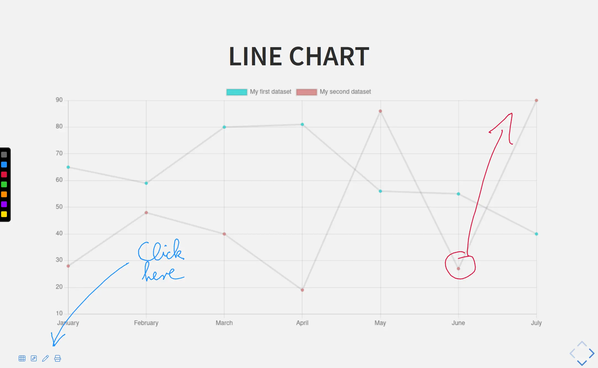
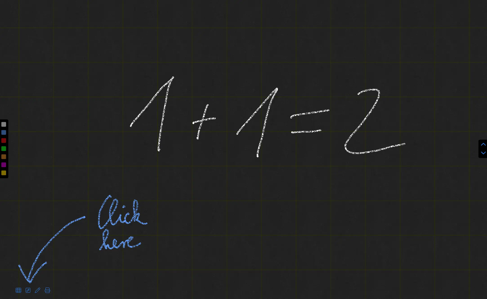
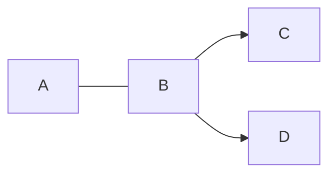
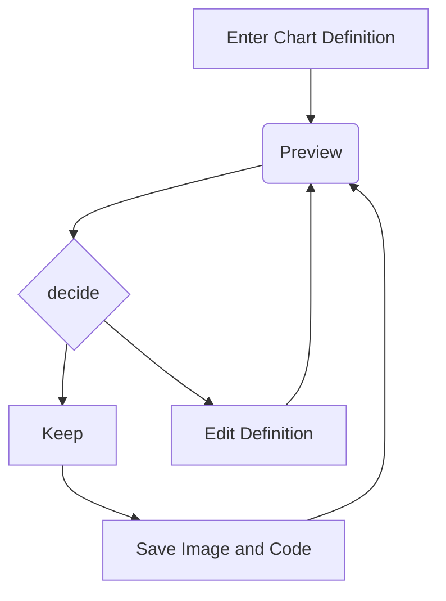
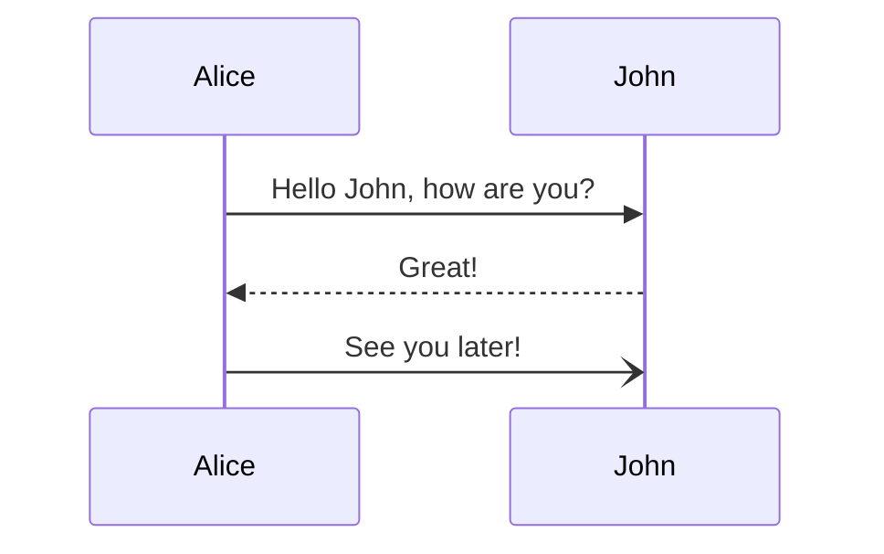
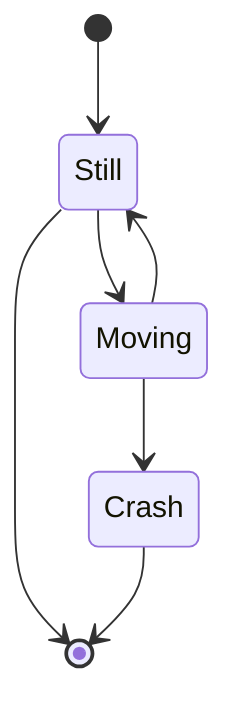
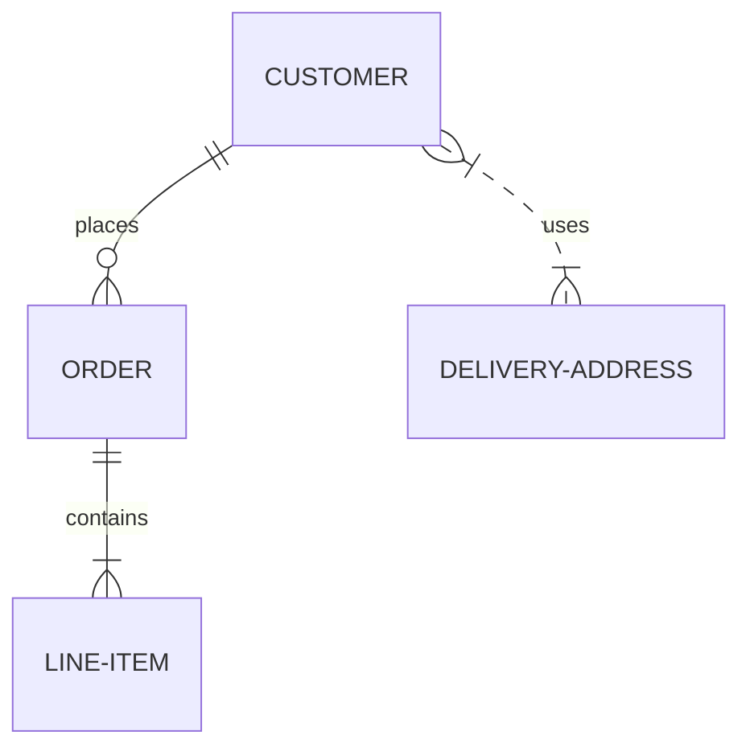
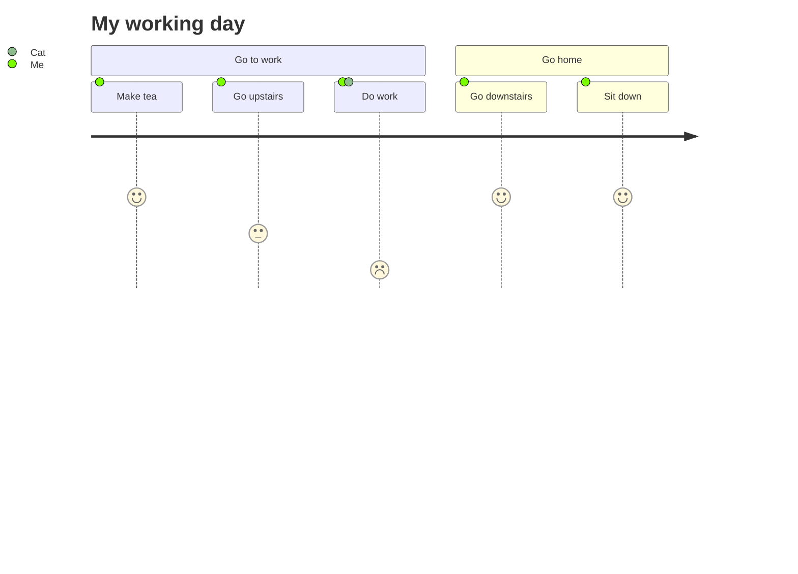
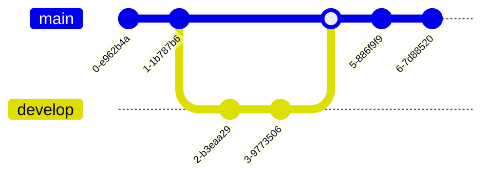

---
# This is a Slidesdown presentation. Learn about Slidesdown at https://slidesdown.github.io

# Metadata about the presentation:
title: Slidesdown
subject: Showcasing slidesdown
author: Jan Christoph Ebersbach
date: 2023-01-20
keywords: slides slideshow slidesdown presentation presentations markup markdown revealjs fontawesome pdf

# Presentation settings:
# URL to favicon
favicon: /favicon.svg
# Theme, list of supported themes: https://github.com/slidesdown/slidesdown.github.io/tree/main/vendor/reveal.js/dist/theme
theme: white
# Code highlighting theme, list of supported themes: https://github.com/slidesdown/slidesdown.github.io/tree/main/vendor/highlight.js
highlight-theme: tokyo-night-dark

# Show progress bar
progress: true
# Show controls
controls: true
# Center presentation
center: true
# Create separate pages for fragments
pdfSeparateFragments: false
# Loop the presentation
loop: false
# Controls automatic progression to the next slide
# - 0:      Auto-sliding only happens if the data-autoslide HTML attribute
#           is present on the current slide or fragment
# - 1+:     All slides will progress automatically at the given interval in milliseconds
# - false:  No auto-sliding, even if data-autoslide is present
autoSlide: 0
# Activate the scroll view (disables 3d navigation), see https://revealjs.com/scroll-view/
# view: scroll
# Full list of supported settings:
# - https://revealjs.com/config/
# - https://github.com/hakimel/reveal.js/blob/master/js/config.js
# - https://github.com/slidesdown/slidesdown/blob/main/public/plugin/slidesdown.js#L758
# UnoCSS styling: https://unocss.dev/interactive/ and https://tailwindcss.com/docs
# Icons: https://icones.js.org and https://unocss.dev/presets/icons
---

#  Slidesdown

<!-- .slide: data-background-gradient="radial-gradient(#ccfbf1, #ffe4e6)" -->

> Presentations at the speed of Markdown<br /><small>Powered by
> <a href="https://revealjs.com/">reveal.js</a></small>

<!-- .element: style="background: rgba(255, 255, 255, 0.3)" -->

<style>
/* highlight headings nicely so they stand out against the background */
h2, h3 {
  filter: drop-shadow(10px 10px 7px white);
  border-radius: 0.2em;
  background-color: rgb(255 255 255 / 0.5);
  padding-left: 1em;
  padding-right: 1em;
}
h1, h2, h3 {
  width: fit-content;
  margin: 0 auto 2rem auto !important;
}
</style>

## Hi!

<!-- .slide: data-background-image="https://unsplash.com/photos/kfDHPpCQEBQ/download?ixid=M3wxMjA3fDB8MXxzZWFyY2h8MTF8fHNpbXBsZSUyMHBhcGVyfGVufDB8fHx8MTcyMzk5NjQ5OHwy&force=true&w=1920" -->

> Slidesdown makes it simple to quickly turn an idea into a beautiful
> presentation. A [Markdown file](https://slidesdown.github.io/learn.html) is
> all you need!
>
> Press <span class="bg-white/50 inline rounded-xl px-2">Space</span> to advance
> through this presentation.

<!-- .element: style="background: rgba(255, 255, 255, 0.3)" -->

<!-- generated with
!deno run --allow-read --allow-write https://deno.land/x/remark_format_cli@0.4.0/remark-format.js --maxdepth 2 %
-->

## Agenda

<!-- .slide: data-background-image="https://unsplash.com/photos/p_bcKiZDKyk/download?ixid=M3wxMjA3fDB8MXxzZWFyY2h8MTQwfHxmcmFtZXxlbnwwfHx8fDE3MjM5NzY5Njh8Mg&force=true&w=1920" -->

1. [Introduction](#introduction)
2. [Basics](#basics)
3. [Layouts](#layouts)
4. [Animations](#animations)
5. [Background](#background)
6. [Pictures and Icons](#pictures-and-icons)
7. [Advanced Formatting](#advanced-formatting)
8. [Charts](#charts)
9. [Diagrams](#diagrams)

## Introduction

<!-- .slide: data-background-image="https://unsplash.com/photos/1_CMoFsPfso/download?force=true&w=1920" -->

### Features

- Focus: No setup, just write Markdown
- Sharable: [Create links](https://slidesdown.github.io/loader.html) to public
  slides or store whole presentations in a link
- Offline First: Local [CLI avaiable](https://github.com/slidesdown/slidesdown)
- Multiplex Mode: Jointly view slides via a dynamically generated URL
- Professional: PDF export, custom themes, and UnoCSS styling
- Visualizations: Charts and diagrams via
  [Apache ECharts](https://echarts.apache.org/) and
  [mermaid.js](https://mermaid.js.org/)
- .. and many more

<!-- .element: class="text-4xl" -->

### Learn how it works

<!-- - [Introduction video to slidesdown](https://youtu.be/ZNXvQGsk_wA) -->

- [Guide to Slidesdown](https://slidesdown.github.io/learn.html)
- Learn by example from other
  [presentations](https://github.com/slidesdown/slidesdown/blob/main/examples)

### Keyboard Shortcuts

- `<Space>` advances to next slide
- `<Shift-Space>` goes to previous slide
- `<f>` enters full-screen mode
- `<s>` shows speaker notes
- `<.>` pauses slideshow
- `<e>` toggles print view
- `<Esc>` toggles slide overview
- `<Alt-Left Mouse Button>` or `<Ctrl-Left Mouse Button>` zooms into slide

notes:

- Some
- speaker
- notes

### Draw on Slides



### Open Blackboard



---

<h2>See for yourself..</h2>

<!-- .slide: data-background-image="https://unsplash.com/photos/q1RZ6fAR-i4/download?ixid=M3wxMjA3fDB8MXxzZWFyY2h8MTZ8fGRpc2NvdmVyfGVufDB8fHx8MTcyMzk5NDM4N3wy&force=true&w=1920" -->

## Basics

<!-- .slide: data-background-image="https://unsplash.com/photos/nDd3dIkkOLo/download?force=true&w=1920" -->

### Headings

<div class="grid grid-cols-2">

<div>
  <h1>h1</h1>
  <h2>h2</h2>
  <h3>h3</h3>
</div>

    # h1

    ## h2

    ### h3

<!-- .element: class="markdown" -->

</div>

|||

Slide without heading.

    <!-- Horizontal slide -->

    ---

    content

    <!-- Vertical slide -->

    |||

    content

<!-- .element: class="markdown" -->

### Next comes a hidden slide

Can you see it?

    ### Hidden slide

    <!-- .slide: data-visibility="hidden" -->

<!-- .element: class="markdown" -->

### Hidden slide

<!-- .slide: data-visibility="hidden" -->

### Text formatting

Regluar, _italic_, **bold**, and <u>underlined</u>.

```markdown
Regluar, _italic_, **bold**, and <u>underlined</u>.
```

### Unordered List

- Item 1
  - Sub Item
- Item 2
- Item 3

```markdown
- Item 1
  - Sub item
- Item 2
- Item 3
```

### Ordered List

1. Item 1
   1. Sub item
2. Item 2
   - Sub item unordered
3. Item 3

```markdown
1. Item 1
   1. Sub item ordered
2. Item 2
   - Sub item unordered
3. Item 3
```

### Links

<div class="grid grid-cols-2 items-center">

[Text link](https://github.com/slidesdown/slidesdown)

<figure>

[ <!-- .element: style="width: 30%" -->](https://unsplash.com/photos/x9yfTxHpj5w)

<figcaption>Picture link</figcaption>
</figure>

</div>

```markdown
[Text link](https://github.com/slidesdown/slidesdown)

Picture link

[](https://...)
```

</div>

### Quotes

A famous quote

```markdown
> A famous quote
```

### Code Highlighting

```javascript
function hello(msg) {
  alert(`Hello ${msg}`);
}

hello("world!");
```

````markdown
```javascript
function hello(msg) {
  alert(`Hello ${msg}`);
}

hello("world!");
```
````

### Code Highlighting with highlighted Line

```javascript[2]
function hello(msg) {
  alert(`Hello ${msg}`);
}

hello("world!");
```

````markdown
```javascript[2]
function hello(msg) {
  alert(`Hello ${msg}`);
}

hello("world!");
```
````

### Math formulas

`$$ \sum_{n=1}^{\infty}\frac{1}{n^2}=\frac{\pi^2}{6} $$`

`$$ e^{\pi i}=-1 $$`

```markdown
`$$ \sum_{n=1}^{\infty}\frac{1}{n^2}=\frac{\pi^2}{6} $$`

`$$ e^{\pi i}=-1 $$`
```

### Table

| Tables        |      Are      |  Cool |
| ------------- | :-----------: | ----: |
| column 3 is   | right-aligned | $1600 |
| column 2 is   |   centered    |   $12 |
| zebra stripes |   are neat    |    $1 |

```markdown
| Tables        |      Are      |  Cool |
| ------------- | :-----------: | ----: |
| column 3 is   | right-aligned | $1600 |
| column 2 is   |   centered    |   $12 |
| zebra stripes |   are neat    |    $1 |
```

## Layouts

<!-- .slide: data-background-image="https://unsplash.com/photos/WaWSbX44KIo/download?ixid=M3wxMjA3fDB8MXxzZWFyY2h8OHx8bGF5b3V0fGVufDB8fHx8MTcyMzk5NDY5OHwy&force=true&w=1920" -->

### 1 Column

<div class="grid grid-cols-2">

<article>
<div class="flex flex-col">
Shopping List

- Bread
- Milk
- Butter

</div>

<div class="flex flex-col">
Task List

- Sleep
- Eat
- Work

</div>

<div class="flex flex-col">
Bucket List

- ...

</div>
</article>

```markdown
<div class="flex flex-col">
Shopping List

- Bread
- Milk
- Butter

</div>

<div class="flex flex-col">
Task List

- Sleep
- Eat
- Work

</div>

<div class="flex flex-col">
Bucket List

- ...

</div>
```

</div>

### 2 Columns

<div class="grid grid-cols-2">

<div class="grid grid-cols-2">
<div class="flex flex-col">
Shopping List

- Bread
- Milk
- Butter

</div>

<div class="flex flex-col">
Task List

- Sleep
- Eat
- Work

</div>

<div class="flex flex-col">
Bucket List

- ...

</div>
</div>

```markdown
<div class="grid grid-cols-2">
<div class="flex flex-col">
Shopping List

- Bread
- Milk
- Butter

</div>

<div class="flex flex-col">
Task List

- Sleep
- Eat
- Work

</div>

<div class="flex flex-col">
Bucket List

- ...

</div>
</div>
```

</div>

### 3 Columns

<div class="grid grid-cols-3">
<div class="flex flex-col">
Shopping List

- Bread
- Milk
- Butter

</div>

<div class="flex flex-col">
Task List

- Sleep
- Eat
- Work

</div>

<div class="flex flex-col">
Bucket List

- ...

</div>

</div>

```markdown
<div class="grid grid-cols-3">
...
</div>
```

### Complex: Grid

<div class="grid grid-cols-2 gap-3 align-center justify-center">
<div class="grid gap-3 [grid-template:_'header_header'_'sidebar_main'_/_40%_60%]">

<div class="grid-area-[header] flex flex-col bg-green c-white">
Shopping List

- Bread
- Milk
- Butter

</div>

<div class="grid-area-[sidebar] flex flex-col bg-blue c-white">
Task List

- Sleep
- Eat
- Work

</div>

<div class="grid-area-[main] flex flex-col bg-red c-white">
Bucket List

- NYC
- Tokyo
- Singapore

</div>
</div>

```markdown
<div class="grid gap-3 [grid-template:_'header_header'_'sidebar_main'_/_40%_60%]">

<div class="grid-area-[header] flex flex-col bg-green c-white">
Shopping List

- Bread
- Milk
- Butter

</div>

<div class="grid-area-[sidebar] flex flex-col bg-blue c-white">
Task List

- Sleep
- Eat
- Work

</div>

<div class="grid-area-[main] flex flex-col bg-red c-white">
Bucket List

- NYC
- Tokyo
- Singapore

</div>
```

</div>

### Complex: Slide Grid

<!-- .element: class="grid-area-[header] bg-blue text-white! before-content-['Heading:_']" -->
<!-- .slide: class="grid! [grid-template:_'aside_main'_'aside_header'_'code_code'] gap-2 text-white" -->

<aside class="grid-area-[aside] bg-green p-2">

- Aside section

</aside>

<main class="grid-area-[main] bg-red p-2">

- Main section
- Freely arrange elements
- inside a grid that encompasses the whole slide

</main>

<main class="grid-area-[code] text-2xl">

```markdown
<!-- .element: class="grid-area-[header] bg-blue text-white! before-content-['Heading:_']" -->
<!-- .slide: class="grid! [grid-template:_'aside_main'_'aside_header'] gap-2 text-white" -->

<aside class="grid-area-[aside] bg-green p-2">

- Aside section

</aside>

<main class="grid-area-[main] bg-red p-2">

- Main section
- Freely arrange elements
- inside a grid that encompasses the whole slide

</main>
```

</footer>

## Animations

<!-- .slide: data-background-image="https://unsplash.com/photos/KHipnBn7sdY/download?ixid=M3wxMjA3fDB8MXxzZWFyY2h8MTR8fG1vdmVtZW50fGVufDB8fHx8MTcyMzk5NDgyNnwy&force=true&w=1920" -->

### Incremental Lists

- Item 1 <!-- .element: class="fragment" -->
- Item 2 <!-- .element: class="fragment" -->
- Item 3 <!-- .element: class="fragment" -->

```markdown
- Item 1 <!-- .element: class="fragment" -->
- Item 2 <!-- .element: class="fragment" -->
- Item 3 <!-- .element: class="fragment" -->
```

### Fragments

<div class="grid grid-cols-2 items-center justify-items-center">
  
  
<!-- .element: class="fragment" -->
</div>

```markdown
<div class="grid grid-cols-2 items-center justify-items-center">


<!-- .element: class="fragment" -->
</div>
```

### Animated List

<!-- .slide: data-auto-animate="1" -->

- Item 1
- Item 3
- Item 4

```markdown
<!-- .slide: data-auto-animate="1" -->

- Item 1
- Item 3
- Item 4
```

### Animated List

<!-- .slide: data-auto-animate="1" -->

- Item 1
- Item 2
- Item 3
- Item 4

```markdown
<!-- .slide: data-auto-animate="1" -->

- Item 1
- Item 2
- Item 3
- Item 4
```

### Animated Colored Boxes

<!-- .slide: data-auto-animate="1" -->

<div class="grid grid-cols-3 items-center justify-items-center">
<div data-id="1" class="size-32 rounded-xs bg-blue-300 c-yellow-300">App 1</div>
<div data-id="2" class="size-48 rounded-lg bg-red-300 c-red-800">App 2</div>
<div data-id="3" class="size-64 rounded-full bg-green-300 c-green-800">Circle</div>
</div>

```markdown
<!-- .slide: data-auto-animate="1" -->

<div class="grid grid-cols-3 items-center justify-items-center">
<div data-id="1" class="size-32 rounded-xs bg-blue-300 c-yellow-300">App 1</div>
<div data-id="2" class="size-48 rounded-lg bg-red-300 c-red-800">App 2</div>
<div data-id="3" class="size-64 rounded-full bg-green-300 c-green-800">Circle</div>
</div>
```

### Animated Colored Boxes

<!-- .slide: data-auto-animate="1" -->

<div class="grid grid-cols-3 items-center justify-items-center">
<div data-id="3" class="size-64 rounded-full bg-green-300 c-green-800">Circle</div>
<div data-id="2" class="size-48 rounded-lg bg-red-300 c-red-800">App 2</div>
<div data-id="1" class="size-32 rounded-xs bg-blue-300 c-yellow-300">App 1</div>
</div>

```markdown
<!-- .slide: data-auto-animate="1" -->

<div class="grid grid-cols-3 items-center justify-items-center">
<div data-id="3" class="size-64 rounded-full bg-green-300 c-green-800">Circle</div>
<div data-id="2" class="size-48 rounded-lg bg-red-300 c-red-800">App 2</div>
<div data-id="1" class="size-32 rounded-xs bg-blue-300 c-yellow-300">App 1</div>
</div>
```

## Background

<!-- .slide: data-background-image="https://unsplash.com/photos/QMDap1TAu0g/download?ixid=M3wxMjA3fDB8MXxzZWFyY2h8NTh8fHNpbXBsZXxlbnwwfHx8fDE3MjM5MjkxOTh8Mg&force=true&w=1920" -->

### Colored background

<!-- .slide: data-background-color="#78a5e9" -->

```markdown
<!-- .slide: data-background-color="#78a5e9" -->
```

### Gradient background

<!-- .slide: data-background-gradient="linear-gradient(to right, rgb(59, 130, 246), rgb(168, 85, 247), rgb(236, 72, 153))" -->

```markdown
<!-- .slide: data-background-gradient="linear-gradient(to right, rgb(59, 130, 246), rgb(168, 85, 247), rgb(236, 72, 153))" -->
```

See [gradient.codes](https://gradienty.codes/) for more gradient colors.

### Background image

<!-- .slide: data-background-image="https://images.unsplash.com/photo-1499892477393-f675706cbe6e?ixlib=rb-1.2.1\&q=80\&fm=jpg\&crop=entropy\&cs=tinysrgb\&w=640" -->

```markdown
<!-- .slide: data-background-image="https://..." -->
```

## Pictures and Icons

<!-- .slide: data-background-image="https://unsplash.com/photos/iCx-ANNHyDo/download?ixid=M3wxMjA3fDB8MXxzZWFyY2h8OHx8cGljdHVyZXN8ZW58MHx8fHwxNzIzOTE2NjYwfDI&force=true&w=1920" -->

### Picture


```markdown

```

### Framed Picture

<div class="grid justify-items-center">


<!-- .element: class="r-frame h-[20vh]" -->

</div>

```markdown


<!-- .element: class="r-frame" -->
```

### Lightbox

Click the image

<div class="grid justify-items-center">


</div>

```markdown

```

### Embedded Youtube Video

<iframe width="560" height="315" src="https://www.youtube.com/embed/_PPWWRV6gbA?si=UkozGC82h2hs2wJ3" title="YouTube video player" frameborder="0" allow="accelerometer; autoplay; clipboard-write; encrypted-media; gyroscope; picture-in-picture; web-share" referrerpolicy="strict-origin-when-cross-origin" allowfullscreen></iframe>

```markdown
<!-- 1. Open video on YouTube -->
<!-- 2. Click share -->
<!-- 3. Select "Embed" -->
<!-- 4. Copy code -->
<iframe width="560" height="315" src="https://www.youtube.com/embed/_PPWWRV6gbA?si=UkozGC82h2hs2wJ3" title="YouTube video player" frameborder="0" allow="accelerometer; autoplay; clipboard-write; encrypted-media; gyroscope; picture-in-picture; web-share" referrerpolicy="strict-origin-when-cross-origin" allowfullscreen></iframe>
```

### Font Awesome Icon

<div class="i-fa6-solid-face-smile m-auto"></div>

```markdown
<div class="i-fa6-solid-face-smile"></div>
```

Many [more icons and icon sets](https://icones.js.org/) are available.

### Font Awesome Icon with Color

<div class="i-fa6-solid-face-smile w-[8rem] h-[8rem] c-purple m-auto"></div>

```markdown
<div class="i-fa6-solid-face-smile w-[8rem] h-[8rem] c-purple"></div>
```

### Font Awesome Stacked Icons

<div class="grid grid-cols-1">
<div class="flex flex-justify-center gap-10">
<div class="grid grid-cols-5 grid-rows-5 w-[6rem] h-[6rem]">
  <div class="i-fa6-solid-circle grid-area-[1/1/-1/-1] w-full h-full"></div>
  <div class="i-fa6-solid-flag invert grid-area-[2/2/-2/-2] w-full h-full"></div>
</div>

<div class="grid grid-cols-5 grid-rows-5 w-[6rem] h-[6rem]">
  <div class="i-fa6-solid-camera grid-area-[2/2/-2/-2] w-full h-full"></div>
  <div class="i-fa6-solid-ban c-[tomato] grid-area-[1/1/-1/-1] w-full h-full"></div>
</div>
</div>

```markdown
<div class="flex flex-justify-center gap-10">
<div class="grid grid-cols-5 grid-rows-5 w-[6rem] h-[6rem]">
  <div class="i-fa6-solid-circle grid-area-[1/1/-1/-1] w-full h-full"></div>
  <div class="i-fa6-solid-flag invert grid-area-[2/2/-2/-2] w-full h-full"></div>
</div>

<div class="grid grid-cols-5 grid-rows-5 w-[6rem] h-[6rem]">
  <div class="i-fa6-solid-camera grid-area-[2/2/-2/-2] w-full h-full"></div>
  <div class="i-fa6-solid-ban c-[tomato] grid-area-[1/1/-1/-1] w-full h-full"></div>
</div>
</div>
```

</div>

### FontAwesome Bullet Icons

<ul class="grid-area-[left]">
  <li class="list-none flex gap-1 items-center"><div class="h-[calc(var(--r-main-font-size)*0.6)] w-[calc(var(--r-main-font-size)*0.6)] shrink-0"><div class="i-fa6-solid-id-badge c-blue h-full w-full"></div></div> Regular bullet icon</li>
  <li class="list-none flex gap-1 items-center"><div class="h-[calc(var(--r-main-font-size)*0.6)] w-[calc(var(--r-main-font-size)*0.6)] shrink-0"><div class="i-fa6-solid-recycle h-full w-full"></div></div> Regular bullet icon</li>
  <li class="list-none flex gap-1 items-center"><div class="h-[calc(var(--r-main-font-size)*0.6)] w-[calc(var(--r-main-font-size)*0.6)] shrink-0">
      <div class="grid grid-cols-5 grid-rows-5 h-full w-full">
        <div class="i-fa6-solid-person-digging grid-area-[2/2/-2/-2] w-full h-full"></div>
        <div class="i-fa6-solid-ban c-[tomato] grid-area-[1/1/-1/-1] w-full h-full"></div>
      </div>
    </div>
    Stacked bullet icon</li>
</ul>

```markdown
<ul>
  <li class="list-none flex gap-1 items-center"><div class="h-[calc(var(--r-main-font-size)*0.6)] w-[calc(var(--r-main-font-size)*0.6)] shrink-0"><div class="i-fa6-solid-id-badge c-blue h-full w-full"></div></div> Regular bullet icon</li>
  <li class="list-none flex gap-1 items-center"><div class="h-[calc(var(--r-main-font-size)*0.6)] w-[calc(var(--r-main-font-size)*0.6)] shrink-0"><div class="i-fa6-solid-recycle h-full w-full"></div></div> Regular bullet icon</li>
  <li class="list-none flex gap-1 items-center"><div class="h-[calc(var(--r-main-font-size)*0.6)] w-[calc(var(--r-main-font-size)*0.6)] shrink-0">
      <div class="grid grid-cols-5 grid-rows-5 h-full w-full">
        <div class="i-fa6-solid-person-digging grid-area-[2/2/-2/-2] w-full h-full"></div>
        <div class="i-fa6-solid-ban c-[tomato] grid-area-[1/1/-1/-1] w-full h-full"></div>
      </div>
    </div>
    Stacked bullet icon</li>
</ul>
```

## Advanced Formatting

<!-- .slide: data-background-image="https://unsplash.com/photos/gxdctlHPVYk/download?ixid=M3wxMjA3fDB8MXxzZWFyY2h8NXx8YWR2YW5jZWQlMjBza2lsbHxlbnwwfHx8fDE3MjM5OTQ5NDJ8Mg&force=true&w=1920" -->

### Colored <span class="text-red-400">text</span>

```markdown
Colored <span class="text-red-400">text</span>
```

### Gradient Text

<!-- .element: class="bg-gradient-to-r bg-clip-text !text-transparent from-green-400 via-indico-300 to-blue-500" -->

    ### Gradient Text Color

    <!-- .element: class="bg-gradient-to-r bg-clip-text !text-transparent from-green-400 via-indico-300 to-blue-500" -->

<!-- .element: class="markdown" -->

### Box Shadow

<div class="grid grid-cols-2 gap-10">

<span class="shadow">
Shadow regular.
</span>

<span class="shadow-md">
Shadow medium.
</span>

<span class="shadow-lg">
Shadow large.
</span>

<span class="shadow-xl">
Shadow x-large.
</span>

</div>

```markdown
<span class="shadow">Shadow regular.</span>
<span class="shadow-md">Shadow medium.</span>
<span class="shadow-lg">Shadow large.</span>
<span class="shadow-xl">Shadow x-large.</span>
```

### Colored Boxes

<div class="grid grid-cols-3 items-center justify-items-center">
<div class="size-32 rounded-xs bg-blue-300 c-yellow-300">App 1</div>
<div class="size-48 rounded-lg bg-red-300 c-red-800">App 2</div>
<div class="size-64 rounded-full bg-green-300 c-green-800">Circle</div>
</div>

```markdown
<div class="grid grid-cols-3 items-center justify-items-center">
<div class="size-32 rounded-xs bg-blue-300 c-yellow-300">App 1</div>
<div class="size-48 rounded-lg bg-red-300 c-red-800">App 2</div>
<div class="size-64 rounded-full bg-green-300 c-green-800">Circle</div>
</div>
```

### Font Awesome Buttons

<div class="grid grid-cols-3 items-center justify-items-center">
<div class="flex items-center justify-center size-32 rounded-xs shadow-xs bg-blue-300 c-yellow-300"><div class="i-fa6-solid-thumbs-up"></div></div>
<div class="text-4xl flex items-center justify-center size-48 rounded-lg shadow-lg bg-red-300 c-red-800"><div class="i-fa6-solid-thumbtack"></div></div>
<div class="text-6xl flex items-center justify-center size-64 rounded-full shadow-xl bg-green-300 c-green-800"><div class="i-fa6-solid-headphones"></div></div>
</div>

```markdown
<div class="grid grid-cols-3 items-center justify-items-center">
<div class="flex items-center justify-center size-32 rounded-xs shadow-xs bg-blue-300 c-yellow-300"><div class="i-fa6-solid-thumbs-up"></div></div>
<div class="text-4xl flex items-center justify-center size-48 rounded-lg shadow-lg bg-red-300 c-red-800"><div class="i-fa6-solid-thumbtack"></div></div>
<div class="text-6xl flex items-center justify-center size-64 rounded-full shadow-xl bg-green-300 c-green-800"><div class="i-fa6-solid-headphones"></div></div>
</div>
```

### Picture Buttons

<div class="grid grid-cols-4 items-center justify-items-center">
<div class="size-32 rounded-xs overflow-hidden bg-cover shadow-xs" style='background-image: url("https://images.unsplash.com/photo-1595537725181-0f127e2feeb2?ixlib=rb-1.2.1&q=80&fm=jpg&crop=entropy&cs=tinysrgb&w=640");'></div>
<div class="size-38 rounded-lg overflow-hidden bg-cover shadow-lg" style='background-image: url("https://images.unsplash.com/photo-1595589982168-77b64bc1b485?ixlib=rb-1.2.1&q=80&fm=jpg&crop=entropy&cs=tinysrgb&w=640");'></div>
<div class="size-44 rounded-xl overflow-hidden bg-cover shadow-xl" style='background-image: url("https://images.unsplash.com/photo-1595586964632-b215dfbc064a?ixlib=rb-1.2.1&q=80&fm=jpg&crop=entropy&cs=tinysrgb&w=640");'></div>
<div class="size-50 rounded-full overflow-hidden bg-cover shadow-2xl" style='background-image: url("https://images.unsplash.com/photo-1595508064774-5ff825ff0f81?ixlib=rb-1.2.1&q=80&fm=jpg&crop=entropy&cs=tinysrgb&w=640");'></div>
</div>

```markdown
<div class="grid grid-cols-4 items-center justify-items-center">
<div class="size-32 rounded-xs overflow-hidden bg-cover shadow-xs" style='background-image: url("https://images.unsplash.com/photo-1595537725181-0f127e2feeb2?ixlib=rb-1.2.1&q=80&fm=jpg&crop=entropy&cs=tinysrgb&w=640");'></div>
<div class="size-38 rounded-lg overflow-hidden bg-cover shadow-lg" style='background-image: url("https://images.unsplash.com/photo-1595589982168-77b64bc1b485?ixlib=rb-1.2.1&q=80&fm=jpg&crop=entropy&cs=tinysrgb&w=640");'></div>
<div class="size-44 rounded-xl overflow-hidden bg-cover shadow-xl" style='background-image: url("https://images.unsplash.com/photo-1595586964632-b215dfbc064a?ixlib=rb-1.2.1&q=80&fm=jpg&crop=entropy&cs=tinysrgb&w=640");'></div>
<div class="size-50 rounded-full overflow-hidden bg-cover shadow-2xl" style='background-image: url("https://images.unsplash.com/photo-1595508064774-5ff825ff0f81?ixlib=rb-1.2.1&q=80&fm=jpg&crop=entropy&cs=tinysrgb&w=640");'></div>
</div>
```

## Charts

<!-- .slide: data-background-image="https://unsplash.com/photos/IrRbSND5EUc/download?force=true&w=1920" -->

via [Apache ECharts](https://echarts.apache.org)

### Line Chart

With toolbox buttons:

<div class="grid grid-cols-2 items-center justify-items-center">

```echarts
{
  "toolbox": {
    "feature": {
      "dataZoom": {},
      "restore": {},
      "saveAsImage": {}
    }
  },
  "xAxis": {
    "type": "category",
    "data": [ "Mon", "Tue", "Wed", "Thu", "Fri", "Sat", "Sun" ]
  },
  "yAxis": {
    "type": "value"
  },
  "series": [
    {
      "data": [ 150, 230, 224, 218, 135, 147, 260 ],
      "type": "line"
    }
  ]
}
```

````markdown
```echarts
{
  "toolbox": {
    "feature": {
      "dataZoom": {},
      "restore": {},
      "saveAsImage": {}
    }
  },
  "xAxis": {
    "type": "category",
    "data": [ "Mon", "Tue", "Wed", "Thu", "Fri", "Sat", "Sun" ]
  },
  "yAxis": {
    "type": "value"
  },
  "series": [
    {
      "data": [ 150, 230, 224, 218, 135, 147, 260 ],
      "type": "line"
    }
  ]
}
```
````

### Bar Chart

<div class="grid grid-cols-2 items-center justify-items-center">

```echarts
{
  "xAxis": {
    "data": ["shirt", "cardigan", "chiffon"]
  },
  "yAxis": {},
  "series": [
    {
      "name": "sales",
      "type": "bar",
      "data": [5, 20, 36]
    }
  ]
}
```

````markdown
```echarts
{
  "xAxis": {
    "data": ["shirt", "cardigan", "chiffon"]
  },
  "yAxis": {},
  "series": [
    {
      "name": "sales",
      "type": "bar",
      "data": [5, 20, 36]
    }
  ]
}
```
````

</div>

### Stacked Area Chart

<div class="grid grid-cols-2 items-center justify-items-center">

```echarts
{
  "tooltip": {
    "trigger": "axis",
    "axisPointer": {
      "type": "cross",
      "label": {
        "backgroundColor": "#6a7985"
      }
    }
  },
  "legend": {
    "data": [
      "Email",
      "Union Ads",
      "Video Ads",
      "Direct",
      "Search Engine"
    ]
  },
  "grid": {
    "left": "3%",
    "right": "4%",
    "bottom": "3%",
    "containLabel": true
  },
  "xAxis": [
    {
      "type": "category",
      "boundaryGap": false,
      "data": [
        "Mon",
        "Tue",
        "Wed",
        "Thu",
        "Fri",
        "Sat",
        "Sun"
      ]
    }
  ],
  "yAxis": [
    {
      "type": "value"
    }
  ],
  "series": [
    {
      "name": "Email",
      "type": "line",
      "stack": "Total",
      "areaStyle": {},
      "emphasis": {
        "focus": "series"
      },
      "data": [
        120,
        132,
        101,
        134,
        90,
        230,
        210
      ]
    },
    {
      "name": "Union Ads",
      "type": "line",
      "stack": "Total",
      "areaStyle": {},
      "emphasis": {
        "focus": "series"
      },
      "data": [
        220,
        182,
        191,
        234,
        290,
        330,
        310
      ]
    },
    {
      "name": "Video Ads",
      "type": "line",
      "stack": "Total",
      "areaStyle": {},
      "emphasis": {
        "focus": "series"
      },
      "data": [
        150,
        232,
        201,
        154,
        190,
        330,
        410
      ]
    },
    {
      "name": "Direct",
      "type": "line",
      "stack": "Total",
      "areaStyle": {},
      "emphasis": {
        "focus": "series"
      },
      "data": [
        320,
        332,
        301,
        334,
        390,
        330,
        320
      ]
    },
    {
      "name": "Search Engine",
      "type": "line",
      "stack": "Total",
      "label": {
        "show": true,
        "position": "top"
      },
      "areaStyle": {},
      "emphasis": {
        "focus": "series"
      },
      "data": [
        820,
        932,
        901,
        934,
        1290,
        1330,
        1320
      ]
    }
  ]
}
```

````markdown
```echarts
{"tooltip":{"trigger":"axis","axisPointer":{"type":"cross","label":{"backgroundColor":"#6a7985"}}},
"legend":{"data":["Email","Union Ads","Video Ads","Direct","Search Engine"]},"grid":{"left":"3%",
"right":"4%","bottom":"3%","containLabel":true},"xAxis":[{"type":"category","boundaryGap":false,
"data":["Mon","Tue","Wed","Thu","Fri","Sat","Sun"]}],"yAxis":[{"type":"value"}],"series":
[{"name":"Email","type":"line","stack":"Total","areaStyle":{},
"emphasis":{"focus":"series"},"data":[120,132,101,134,90,230,210]},{"name":"Union Ads","type":"line",
"stack":"Total","areaStyle":{},"emphasis":{"focus":"series"},"data":[220,182,191,234,290,330,310]},
{"name":"Video Ads","type":"line","stack":"Total","areaStyle":{},"emphasis":{"focus":"series"},
"data":[150,232,201,154,190,330,410]},{"name":"Direct","type":"line","stack":"Total","areaStyle":{},
"emphasis":{"focus":"series"},"data":[320,332,301,334,390,330,320]},{"name":"Search Engine","type":"line"
,"stack":"Total","label":{"show":true,"position":"top"},"areaStyle":{},"emphasis":{"focus":"series"},
"data":[820,932,901,934,1290,1330,1320]}]}
```
````

</div>

### More Examples

See [docs](https://echarts.apache.org/examples/en/index.html)

## Diagrams

<!-- .slide: data-background-image="https://unsplash.com/photos/lFtttcsx5Vk/download?force=true&w=1920" -->

via [mermaid.js](https://mermaid.js.org/)

### Flowchart

<div class="grid grid-cols-2 items-center justify-items-center">



````markdown

````

</div>

### Flowchart Complex

<div class="grid grid-cols-2 items-center justify-items-center">



````markdown

````

</div>

### Sequence Diagram

<div class="grid grid-cols-2 items-center justify-items-center">



````markdown

````

</div>

### State Diagram

<div class="grid grid-cols-2 items-center justify-items-center">



````markdown

````

</div>

### Entity Relationship Diagram

<div class="grid grid-cols-2 items-center justify-items-center">



````markdown

````

</div>

### User Journey Diagram

<div class="grid grid-cols-2 items-center justify-items-center">



````markdown

````

</div>

### Git Graph

<div class="grid grid-cols-2 items-center justify-items-center">



````markdown

````

</div>

---

<h2 class="bg-white/50 inline rounded-xl px-2" >Thank you</h2>

<!-- .slide: data-background-image="https://unsplash.com/photos/h4KYT7X1HM4/download?ixid=M3wxMjA3fDB8MXxzZWFyY2h8MTN8fHRoYW5rJTIweW91fGVufDB8fHx8MTcyMzk2ODcwMHwy&force=true&w=1920" -->

<strong>for using
<a href="https://github.com/slidesdown/slidesdown">Slidesdown</a></strong>
