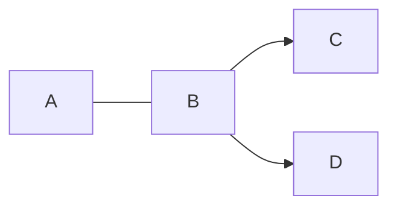
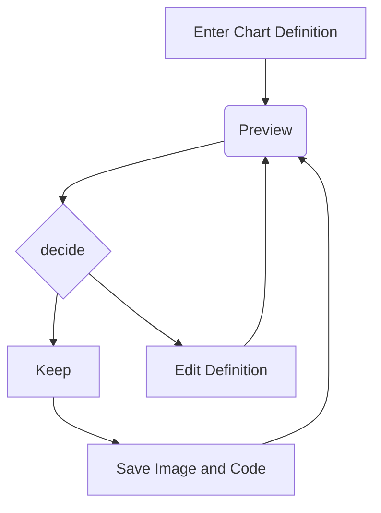
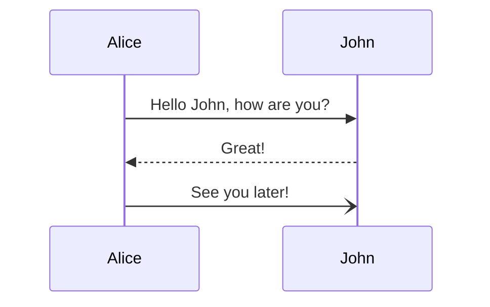
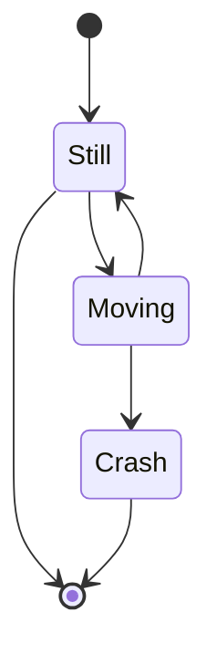
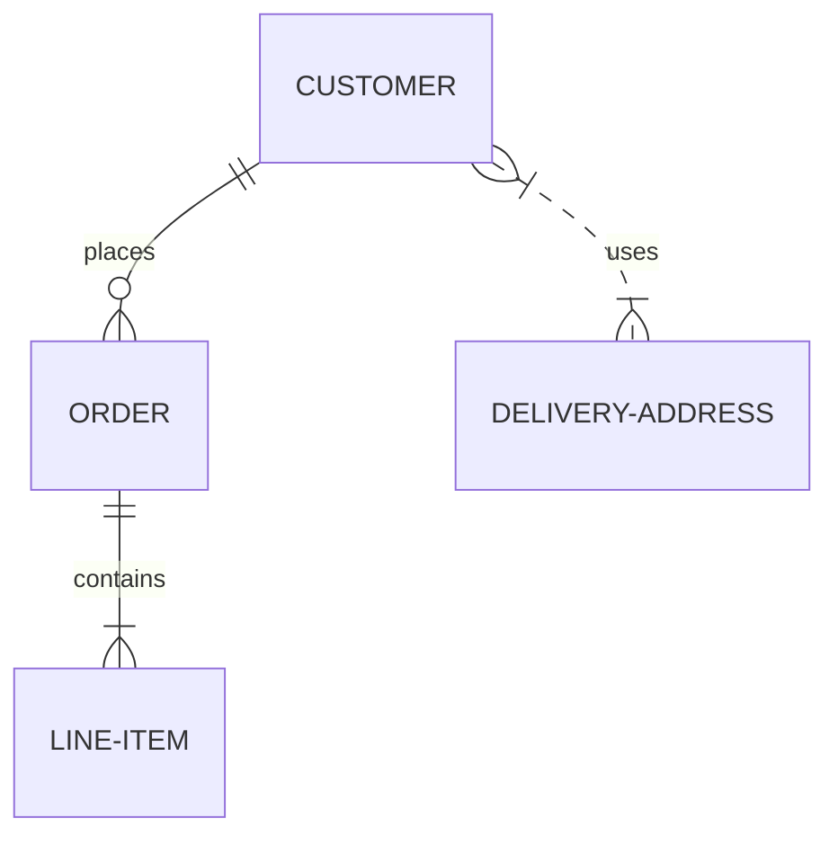
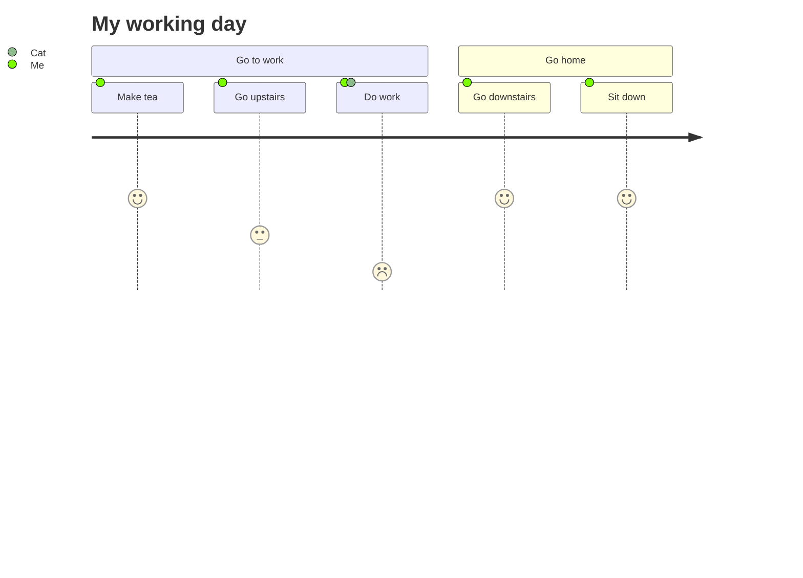
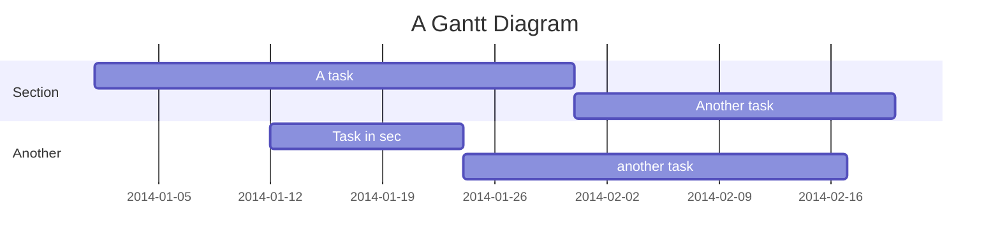

---
# Metadata about the presentation:
title: Slidesdown
subject: Showcasing slidesdown
author: Jan Christoph Ebersbach
date: 2023-01-20
keywords: slides slideshow slidesdown presentation presentations markup markdown revealjs fontawesome pdf

# Presentation settings:
# URL to favicon
favicon: /favicon.svg
# Theme, list of supported themes: https://github.com/slidesdown/slidesdown.github.io/tree/main/vendor/reveal.js/dist/theme
theme: white
# Code highlighting theme, list of supported themes: https://github.com/slidesdown/slidesdown.github.io/tree/main/vendor/highlight.js
highlight-theme: tokyo-night-dark

# Show progress bar
progress: true
# Show controls
controls: true
# Center presentation
center: true
# Create separate pages for fragments
pdfSeparateFragments: false
# Full list of supported settings: https://revealjs.com/config/ or
# https://github.com/hakimel/reveal.js/blob/master/js/config.js
# UnoCSS styling: https://unocss.dev/interactive/ and https://tailwindcss.com/docs
# Icons: https://icones.js.org and https://unocss.dev/presets/icons
---

#  Slidesdown

> Slideshows as fast as you can type. <small>Created by
> <a href="mailto:jceb@e-jc.de">Jan Christoph Ebersbach</a> and powered by
> <a href="https://revealjs.com/">reveal.js</a></small>

<!-- .element: style="background: rgba(255, 255, 255, 0.3)" -->

## Hi!

<!-- .slide: data-background-image="https://unsplash.com/photos/kfDHPpCQEBQ/download?ixid=M3wxMjA3fDB8MXxzZWFyY2h8MTF8fHNpbXBsZSUyMHBhcGVyfGVufDB8fHx8MTcyMzk5NjQ5OHwy&force=true&w=1920" -->

<!-- .element: class="bg-white/50 inline rounded-xl px-2" -->

> Slidesdown makes it simple to quickly turn an idea into a beautiful
> presentation. A [Markdown file](https://slidesdown.github.io/learn.html) is all
> you need!
>
> Press <span class="bg-white/50 inline rounded-xl px-2">Space</span> to advance through this presentation.

<!-- .element: style="background: rgba(255, 255, 255, 0.3)" -->

<!-- generated with
!deno run --allow-read --allow-write https://deno.land/x/remark_format_cli@0.4.0/remark-format.js --maxdepth 2 %
-->

## Agenda

<!-- .slide: data-background-image="https://unsplash.com/photos/p_bcKiZDKyk/download?ixid=M3wxMjA3fDB8MXxzZWFyY2h8MTQwfHxmcmFtZXxlbnwwfHx8fDE3MjM5NzY5Njh8Mg&force=true&w=1920" -->

<!-- .element: class="bg-white/50 inline rounded-xl px-2" -->

1. [Introduction](#introduction)
2. [See for yourself..](#see-for-yourself)
3. [Basics](#basics)
4. [Layouts](#layouts)
5. [Animations](#animations)
6. [Backgrounds](#backgrounds)
7. [Pictures and Icons](#pictures-and-icons)
8. [Advanced Formatting](#advanced-formatting)
9. [Charts: ChartJS](#charts-chartjs)
10. [Charts: ApexCharts](#charts-apexcharts)
11. [Diagrams](#diagrams)

<!-- .element: style="column-count: 2" -->

## Introduction

<!-- .slide: data-background-image="https://unsplash.com/photos/1_CMoFsPfso/download?force=true&w=1920" -->

<!-- .element: class="bg-white/50 inline rounded-xl px-2" -->

### Features

- Setup: No installation required.
- Focus: Just write Markdown.
- Sharable: [Create links](https://slidesdown.github.io/loader.html) to
  slides in git repositories or store the whole presentation in one link.
- Offline First:
  [CLI avaiable](https://github.com/slidesdown/slidesdown/blob/main/README.md)
  for offline presentations.
- Tunnel Support: Share slides online from your laptop.
- Multiplex Mode: Advance presenter and viewer slides together.
- Professional: PDF export, Custom Themes, and UnoCSS Styling.
- Charts and Diagrams: via [chart.js](https://www.chartjs.org/), [apexcharts](https://apexcharts.com/) and
  [mermaid.js](https://mermaid.js.org/).

<!-- .element: class="text-4xl" -->

### Learn how it works

<!-- - [Introduction video to slidesdown](https://youtu.be/ZNXvQGsk_wA) -->

- [Guide to Slidesdown](https://slidesdown.github.io/learn.html)
- Learn by example from other
  [presentations](https://github.com/slidesdown/slidesdown/blob/main/examples)

### Keyboard Shortcuts

- `<Space>` advances to next slide
- `<Shift-Space>` goes to previous slide
- `<f>` enters full-screen mode
- `<s>` shows speaker notes
- `<.>` pauses slideshow
- `<e>` toggles print view
- `<Esc>` toggles slide overview
- `<Alt-Left Mouse Button>` or `<Ctrl-Left Mouse Button>` zooms into slide

notes:

- Some
- speaker
- notes

### Draw on Slides


### Open Blackboard


## See for yourself..

<!-- .slide: data-background-image="https://unsplash.com/photos/q1RZ6fAR-i4/download?ixid=M3wxMjA3fDB8MXxzZWFyY2h8MTZ8fGRpc2NvdmVyfGVufDB8fHx8MTcyMzk5NDM4N3wy&force=true&w=1920" -->

<!-- .element: class="bg-white/50 inline rounded-xl px-2" -->

## Basics

<!-- .slide: data-background-image="https://unsplash.com/photos/nDd3dIkkOLo/download?force=true&w=1920" -->

<!-- .element: class="bg-white/50 inline rounded-xl px-2" -->

### Headings

<div class="grid grid-cols-2">

<div>
  <h1>h1</h1>
  <h2>h2</h2>
  <h3>h3</h3>
</div>

    # h1

    ## h2

    ### h3

<!-- .element: class="markdown" -->

</div>

|||

Slide without heading.

    <!-- Horizontal slide -->

    ---

    content

    <!-- Vertical slide -->

    |||

    content

<!-- .element: class="markdown" -->

### Next comes a hidden slide

Can you see it?

    ### Hidden slide

    <!-- .slide: data-visibility="hidden" -->

<!-- .element: class="markdown" -->

### Hidden slide

<!-- .slide: data-visibility="hidden" -->

### Text formatting

Regluar, _italic_, **bold**, and <u>underlined</u>.

```markdown
Regluar, _italic_, **bold**, and <u>underlined</u>.
```

### Gradient Text

<!-- .element: style="background: linear-gradient(to right, #fc5c7d, #6a82fb); -webkit-background-clip: text; -webkit-text-fill-color: transparent;" -->

    ### Gradient Text Color

    <!-- .element: style="background: linear-gradient(to right, #fc5c7d, #6a82fb); -webkit-background-clip: text; -webkit-text-fill-color: transparent;" -->

<!-- .element: class="markdown" -->

### Unordered List

- Item 1
- Item 2
- Item 3

```markdown
- Item 1
- Item 2
- Item 3
```

### Ordered List

1. Item 1
2. Item 2
3. Item 3

```markdown
1. Item 1
2. Item 2
3. Item 3
```

### Links

<div class="grid grid-cols-2 items-center">

[Text link](https://github.com/slidesdown/slidesdown)

<figure>

[ <!-- .element: style="width: 30%" -->](https://unsplash.com/photos/x9yfTxHpj5w)

<figcaption>Picture link</figcaption>
</figure>

</div>

```markdown
[Text link](https://github.com/slidesdown/slidesdown)

Picture link

[](https://...)
```

</div>

### Quotes

A famous quote

```markdown
> A famous quote
```

### Code Highlighting

```javascript
function hello(msg) {
  alert(`Hello ${msg}`);
}

hello("world!");
```

````markdown
```javascript
function hello(msg) {
  alert(`Hello ${msg}`);
}

hello("world!");
```
````

### Code Highlighting with highlighted Line

```javascript[2]
function hello(msg) {
  alert(`Hello ${msg}`);
}

hello("world!");
```

````markdown
```javascript[2]
function hello(msg) {
  alert(`Hello ${msg}`);
}

hello("world!");
```
````

### Math formulas

`$$ \sum_{n=1}^{\infty}\frac{1}{n^2}=\frac{\pi^2}{6} $$`

`$$ e^{\pi i}=-1 $$`

```markdown
`$$ \sum_{n=1}^{\infty}\frac{1}{n^2}=\frac{\pi^2}{6} $$`

`$$ e^{\pi i}=-1 $$`
```

### Table

| Tables        |      Are      |  Cool |
| ------------- | :-----------: | ----: |
| column 3 is   | right-aligned | $1600 |
| column 2 is   |   centered    |   $12 |
| zebra stripes |   are neat    |    $1 |

```markdown
| Tables        |      Are      |  Cool |
| ------------- | :-----------: | ----: |
| column 3 is   | right-aligned | $1600 |
| column 2 is   |   centered    |   $12 |
| zebra stripes |   are neat    |    $1 |
```

## Layouts

<!-- .slide: data-background-image="https://unsplash.com/photos/WaWSbX44KIo/download?ixid=M3wxMjA3fDB8MXxzZWFyY2h8OHx8bGF5b3V0fGVufDB8fHx8MTcyMzk5NDY5OHwy&force=true&w=1920" -->

<!-- .element: class="bg-white/50 inline rounded-xl px-2" -->

### 1 Column

<div class="grid grid-cols-2">

<article>
<div class="flex flex-col">
Shopping List

- Bread
- Milk
- Butter

</div>

<div class="flex flex-col">
Task List

- Sleep
- Eat
- Work

</div>

<div class="flex flex-col">
Bucket List

- ...

</div>
</article>

```markdown
<div class="flex flex-col">
Shopping List

- Bread
- Milk
- Butter

</div>

<div class="flex flex-col">
Task List

- Sleep
- Eat
- Work

</div>

<div class="flex flex-col">
Bucket List

- ...

</div>
```

</div>

### 2 Columns

<div class="grid grid-cols-2">

<div class="grid grid-cols-2">
<div class="flex flex-col">
Shopping List

- Bread
- Milk
- Butter

</div>

<div class="flex flex-col">
Task List

- Sleep
- Eat
- Work

</div>

<div class="flex flex-col">
Bucket List

- ...

</div>
</div>

```markdown
<div class="grid grid-cols-2">
<div class="flex flex-col">
Shopping List

- Bread
- Milk
- Butter

</div>

<div class="flex flex-col">
Task List

- Sleep
- Eat
- Work

</div>

<div class="flex flex-col">
Bucket List

- ...

</div>
</div>
```

</div>

### 3 Columns

<div class="grid grid-cols-3">
<div class="flex flex-col">
Shopping List

- Bread
- Milk
- Butter

</div>

<div class="flex flex-col">
Task List

- Sleep
- Eat
- Work

</div>

<div class="flex flex-col">
Bucket List

- ...

</div>

</div>

```markdown
<div class="grid grid-cols-3">
...
</div>
```

### Complex

<div class="grid grid-cols-2 gap-3">
<div class="grid gap-3" style="grid-template: 'header header header' 'sidebar main main' / 40% 60%">

<div class="grid-area-[header] flex flex-col bg-green c-white">
Shopping List

- Bread
- Milk
- Butter

</div>

<div class="grid-area-[sidebar] flex flex-col bg-blue c-white">
Task List

- Sleep
- Eat
- Work

</div>

<div class="grid-area-[main] flex flex-col bg-red c-white">
Bucket List

- NYC
- Tokyo
- Singapore

</div>
</div>

```markdown
<div class="grid gap-3" style="grid-template: 'header header header' 'sidebar main main' / 40% 60%">

<div class="grid-area-[header] flex flex-col bg-green c-white">
Shopping List

- Bread
- Milk
- Butter

</div>

<div class="grid-area-[sidebar] flex flex-col bg-blue c-white">
Task List

- Sleep
- Eat
- Work

</div>

<div class="grid-area-[main] flex flex-col bg-red c-white">
Bucket List

- NYC
- Tokyo
- Singapore

</div>
```

</div>

## Animations

<!-- .slide: data-background-image="https://unsplash.com/photos/KHipnBn7sdY/download?ixid=M3wxMjA3fDB8MXxzZWFyY2h8MTR8fG1vdmVtZW50fGVufDB8fHx8MTcyMzk5NDgyNnwy&force=true&w=1920" -->

<!-- .element: class="bg-white/50 inline rounded-xl px-2" -->

### Incremental Lists

- Item 1 <!-- .element: class="fragment" -->
- Item 2 <!-- .element: class="fragment" -->
- Item 3 <!-- .element: class="fragment" -->

```markdown
- Item 1 <!-- .element: class="fragment" -->
- Item 2 <!-- .element: class="fragment" -->
- Item 3 <!-- .element: class="fragment" -->
```

### Fragments

<div class="grid grid-cols-2 items-center justify-items-center">
  
  
<!-- .element: class="fragment" -->
</div>

```markdown
<div class="grid grid-cols-2 items-center justify-items-center">


<!-- .element: class="fragment" -->
</div>
```

### Animated List

<!-- .slide: data-auto-animate="1" -->

- Item 1
- Item 3
- Item 4

```markdown
<!-- .slide: data-auto-animate="1" -->

- Item 1
- Item 3
- Item 4
```

### Animated List

<!-- .slide: data-auto-animate="1" -->

- Item 1
- Item 2
- Item 3
- Item 4

```markdown
<!-- .slide: data-auto-animate="1" -->

- Item 1
- Item 2
- Item 3
- Item 4
```

### Animated Colored Boxes

<!-- .slide: data-auto-animate="1" -->

<div class="grid grid-cols-3 items-center justify-items-center">
<div data-id="1" class="wh-8rem r-10p" style="background-color: lightblue; color: yellow">App 1</div>
<div data-id="2" class="wh-10rem r-20p" style="background-color: pink; color: darkred;">App 2</div>
<div data-id="3" class="wh-12rem r-50p" style="background-color: lightgreen; color: darkgreen;">Circle</div>
</div>

```markdown
<!-- .slide: data-auto-animate="1" -->

<div class="grid grid-cols-3 items-center justify-items-center">
<div data-id="1" class="wh-8rem r-10p" style="background-color: lightblue; color: yellow">App 1</div>
<div data-id="2" class="wh-10rem r-20p" style="background-color: pink; color: darkred;">App 2</div>
<div data-id="3" class="wh-12rem r-50p" style="background-color: lightgreen; color: darkgreen;">Circle</div>
</div>
```

### Animated Colored Boxes

<!-- .slide: data-auto-animate="1" -->

<div class="grid grid-cols-3 items-center justify-items-center">
<div data-id="3" class="wh-12rem r-50p" style="background-color: lightgreen; color: darkgreen;">Circle</div>
<div data-id="2" class="wh-10rem r-20p" style="background-color: pink; color: darkred;">App 2</div>
<div data-id="1" class="wh-8rem r-10p" style="background-color: lightblue; color: yellow">App 1</div>
</div>

```markdown
<!-- .slide: data-auto-animate="1" -->

<div class="grid grid-cols-3 items-center justify-items-center">
<div data-id="3" class="wh-12rem r-50p" style="background-color: lightgreen; color: darkgreen;">Circle</div>
<div data-id="2" class="wh-10rem r-20p" style="background-color: pink; color: darkred;">App 2</div>
<div data-id="1" class="wh-8rem r-10p" style="background-color: lightblue; color: yellow">App 1</div>
</div>
```

## Backgrounds

<!-- .slide: data-background-image="https://unsplash.com/photos/QMDap1TAu0g/download?ixid=M3wxMjA3fDB8MXxzZWFyY2h8NTh8fHNpbXBsZXxlbnwwfHx8fDE3MjM5MjkxOTh8Mg&force=true&w=1920" -->

<!-- .element: class="bg-white/50 inline rounded-xl px-2" -->

### Colored background

<!-- .slide: data-background-color="#78a5e9" -->

```markdown
<!-- .slide: data-background-color="#78a5e9" -->
```

### Gradient background

<!-- .slide: data-background-gradient="linear-gradient(#e66465, #9198e5)" -->

```markdown
<!-- .slide: data-background-gradient="linear-gradient(#e66465, #9198e5)" -->
```

### Background image

<!-- .slide: data-background-image="https://images.unsplash.com/photo-1499892477393-f675706cbe6e?ixlib=rb-1.2.1\&q=80\&fm=jpg\&crop=entropy\&cs=tinysrgb\&w=640" -->

```markdown
<!-- .slide: data-background-image="https://..." -->
```

## Pictures and Icons

<!-- .slide: data-background-image="https://unsplash.com/photos/iCx-ANNHyDo/download?ixid=M3wxMjA3fDB8MXxzZWFyY2h8OHx8cGljdHVyZXN8ZW58MHx8fHwxNzIzOTE2NjYwfDI&force=true&w=1920" -->

<!-- .element: class="bg-white/50 inline rounded-xl px-2" -->

### Picture


```markdown

```

### Framed Picture

<div class="grid justify-items-center">


<!-- .element: class="r-frame h-[20vh]" -->

</div>

```markdown


<!-- .element: class="r-frame" -->
```

### Font Awesome Icon

<div class="i-fa6-solid-face-smile m-auto"></div>

```markdown
<div class="i-fa6-solid-face-smile"></div>
```

Many [more icons and icon sets](https://icones.js.org/) are available.

### Font Awesome Icon with Color

<div class="i-fa6-solid-face-smile w-[8rem] h-[8rem] c-purple m-auto"></div>

```markdown
<div class="i-fa6-solid-face-smile w-[8rem] h-[8rem] c-purple"></div>
```

### Font Awesome Stacked Icons

<div class="grid grid-cols-1">
<div class="flex flex-justify-center gap-10">
<div class="grid grid-cols-5 grid-rows-5 w-[6rem] h-[6rem]">
  <div class="i-fa6-solid-circle grid-area-[1/1/-1/-1] w-full h-full"></div>
  <div class="i-fa6-solid-flag invert grid-area-[2/2/-2/-2] w-full h-full"></div>
</div>

<div class="grid grid-cols-5 grid-rows-5 w-[6rem] h-[6rem]">
  <div class="i-fa6-solid-camera grid-area-[2/2/-2/-2] w-full h-full"></div>
  <div class="i-fa6-solid-ban c-[tomato] grid-area-[1/1/-1/-1] w-full h-full"></div>
</div>
</div>

```markdown
<div class="flex flex-justify-center gap-10">
<div class="grid grid-cols-5 grid-rows-5 w-[6rem] h-[6rem]">
  <div class="i-fa6-solid-circle grid-area-[1/1/-1/-1] w-full h-full"></div>
  <div class="i-fa6-solid-flag invert grid-area-[2/2/-2/-2] w-full h-full"></div>
</div>

<div class="grid grid-cols-5 grid-rows-5 w-[6rem] h-[6rem]">
  <div class="i-fa6-solid-camera grid-area-[2/2/-2/-2] w-full h-full"></div>
  <div class="i-fa6-solid-ban c-[tomato] grid-area-[1/1/-1/-1] w-full h-full"></div>
</div>
</div>
```

</div>

### FontAwesome Bullet Icons

<ul class="grid-area-[left]">
  <li class="list-none flex gap-1 items-center"><div class="h-[calc(var(--r-main-font-size)*0.6)] w-[calc(var(--r-main-font-size)*0.6)] shrink-0"><div class="i-fa6-solid-id-badge c-blue h-full w-full"></div></div> Regular bullet icon</li>
  <li class="list-none flex gap-1 items-center"><div class="h-[calc(var(--r-main-font-size)*0.6)] w-[calc(var(--r-main-font-size)*0.6)] shrink-0"><div class="i-fa6-solid-recycle h-full w-full"></div></div> Regular bullet icon</li>
  <li class="list-none flex gap-1 items-center"><div class="h-[calc(var(--r-main-font-size)*0.6)] w-[calc(var(--r-main-font-size)*0.6)] shrink-0">
      <div class="grid grid-cols-5 grid-rows-5 h-full w-full">
        <div class="i-fa6-solid-person-digging grid-area-[2/2/-2/-2] w-full h-full"></div>
        <div class="i-fa6-solid-ban c-[tomato] grid-area-[1/1/-1/-1] w-full h-full"></div>
      </div>
    </div>
    Stacked bullet icon</li>
</ul>

```markdown
<ul>
  <li class="list-none flex gap-1 items-center"><div class="h-[calc(var(--r-main-font-size)*0.6)] w-[calc(var(--r-main-font-size)*0.6)] shrink-0"><div class="i-fa6-solid-id-badge c-blue h-full w-full"></div></div> Regular bullet icon</li>
  <li class="list-none flex gap-1 items-center"><div class="h-[calc(var(--r-main-font-size)*0.6)] w-[calc(var(--r-main-font-size)*0.6)] shrink-0"><div class="i-fa6-solid-recycle h-full w-full"></div></div> Regular bullet icon</li>
  <li class="list-none flex gap-1 items-center"><div class="h-[calc(var(--r-main-font-size)*0.6)] w-[calc(var(--r-main-font-size)*0.6)] shrink-0">
      <div class="grid grid-cols-5 grid-rows-5 h-full w-full">
        <div class="i-fa6-solid-person-digging grid-area-[2/2/-2/-2] w-full h-full"></div>
        <div class="i-fa6-solid-ban c-[tomato] grid-area-[1/1/-1/-1] w-full h-full"></div>
      </div>
    </div>
    Stacked bullet icon</li>
</ul>
```

## Advanced Formatting

<!-- .slide: data-background-image="https://unsplash.com/photos/gxdctlHPVYk/download?ixid=M3wxMjA3fDB8MXxzZWFyY2h8NXx8YWR2YW5jZWQlMjBza2lsbHxlbnwwfHx8fDE3MjM5OTQ5NDJ8Mg&force=true&w=1920" -->

<!-- .element: class="bg-white/50 inline rounded-xl px-2" -->

### Colored <span style="color: #78a5e9">text</span>

```markdown
Colored <span style="color: #78a5e9">text</span>
```

### Box Shadow

<div class="grid grid-cols-2 gap-10">

<span class="shadow">
Shadow regular.
</span>

<span class="shadow-md">
Shadow medium.
</span>

<span class="shadow-lg">
Shadow large.
</span>

<span class="shadow-xl">
Shadow x-large.
</span>

</div>

```markdown
<span class="shadow">Shadow regular.</span>
<span class="shadow-md">Shadow medium.</span>
<span class="shadow-lg">Shadow large.</span>
<span class="shadow-xl">Shadow x-large.</span>
```

### Colored Boxes

<div class="grid grid-cols-3 items-center justify-items-center">
<div class="wh-8rem r-10p" style="background-color: lightblue; color: yellow">App 1</div>
<div class="wh-10rem r-20p" style="background-color: pink; color: darkred;">App 2</div>
<div class="wh-12rem r-50p" style="background-color: lightgreen; color: darkgreen;">Circle</div>
</div>

```markdown
<div class="grid grid-cols-3 items-center justify-items-center">
<div class="wh-8rem r-10p" style="background-color: lightblue; color: yellow">App 1</div>
<div class="wh-10rem r-20p" style="background-color: pink; color: darkred;">App 2</div>
<div class="wh-12rem r-50p" style="background-color: lightgreen; color: darkgreen;">Circle</div>
</div>
```

### Font Awesome Buttons

<div class="grid grid-cols-3 items-center justify-items-center">
<div class="flex a-center j-around wh-8rem r-10p s-trbl" style="background-color: lightblue; color: yellow"><div class="i-fa6-solid-thumbs-up"></div></div>
<div class="fs-4 flex a-center j-around wh-10rem r-20p s-rbl" style="background-color: pink; color: darkred;"><div class="i-fa6-solid-thumbtack"></div></div>
<div class="fs-7 flex a-center j-around wh-12rem r-50p s-rb" style="background-color: lightgreen; color: darkgreen;"><div class="i-fa6-solid-headphones"></div></div>
</div>

```markdown
<div class="grid grid-cols-3 items-center justify-items-center">
<div class="flex a-center j-around wh-8rem r-10p s-trbl" style="background-color: lightblue; color: yellow"><div class="i-fa6-solid-thumbs-up"></div></div>
<div class="fs-4 flex a-center j-around wh-10rem r-20p s-rbl" style="background-color: pink; color: darkred;"><div class="i-fa6-solid-thumbtack"></div></div>
<div class="fs-7 flex a-center j-around wh-12rem r-50p s-rb" style="background-color: lightgreen; color: darkgreen;"><div class="i-fa6-solid-headphones"></div></div>
</div>
```

### Picture Buttons

<div class="grid grid-cols-4 items-center justify-items-center">
<div class="wh-8rem r-10p overflow-hidden background-cover s-trbl" style='background-image: url("https://images.unsplash.com/photo-1595537725181-0f127e2feeb2?ixlib=rb-1.2.1&q=80&fm=jpg&crop=entropy&cs=tinysrgb&w=640");'></div>
<div class="wh-10rem r-20p overflow-hidden background-cover s-rbl" style='background-image: url("https://images.unsplash.com/photo-1595589982168-77b64bc1b485?ixlib=rb-1.2.1&q=80&fm=jpg&crop=entropy&cs=tinysrgb&w=640");'></div>
<div class="wh-12rem r-30p overflow-hidden background-cover s-rb" style='background-image: url("https://images.unsplash.com/photo-1595586964632-b215dfbc064a?ixlib=rb-1.2.1&q=80&fm=jpg&crop=entropy&cs=tinysrgb&w=640");'></div>
<div class="wh-14rem r-50p overflow-hidden background-cover s-bl" style='background-image: url("https://images.unsplash.com/photo-1595508064774-5ff825ff0f81?ixlib=rb-1.2.1&q=80&fm=jpg&crop=entropy&cs=tinysrgb&w=640");'></div>
</div>

```markdown
<div class="grid grid-cols-4 items-center justify-items-center">
<div class="wh-8rem r-10p overflow-hidden background-cover s-trbl" style='background-image: url("https://...");'></div>
<div class="wh-10rem r-20p overflow-hidden background-cover s-rbl" style='background-image: url("https://...");'></div>
<div class="wh-12rem r-30p overflow-hidden background-cover s-rb" style='background-image: url("https://...");'></div>
<div class="wh-14rem r-50p overflow-hidden background-cover s-bl" style='background-image: url("https://...");'></div>
</div>
```

## Charts: ChartJS

via [chart.js](https://www.chartjs.org/)

### Polar Area Chart

<div class="grid grid-cols-2">

```chartjs
{
  "type": "polarArea",
  "data": {
    "labels": [
      "Red",
      "Green",
      "Yellow",
      "Grey",
      "Blue"
    ],
    "datasets": [
      {
        "label": "My First Dataset",
        "data": [
          11,
          16,
          7,
          3,
          14
        ],
        "backgroundColor": [
          "rgb(255, 99, 132)",
          "rgb(75, 192, 192)",
          "rgb(255, 205, 86)",
          "rgb(201, 203, 207)",
          "rgb(54, 162, 235)"
        ]
      }
    ]
  }
}
```

<!-- .element: class="w-[80%] h-[80%]" -->

````json
```chartjs
{
  "type": "polarArea",
  "data": {
    "labels": [
      "Red",
      ...
    ],
    "datasets": [
      {
        "label": "My First Dataset",
        "data": [
          11,
          ...
        ],
        "backgroundColor": [
          "rgb(255, 99, 132)",
          ...
        ]
      }
    ]
  }
}
```
````

</div>

### Line Chart

<div class="grid grid-cols-2">

```chartjs
{
  "type": "line",
  "data": {
   "labels": ["January","February","March","April","May","June","July"],
   "datasets":[
    {
     "data":[65,59,80,81,56,55,40],
     "label":"My first dataset","backgroundColor":"rgba(20,220,220,.8)"
    },
    {
     "data":[28,48,40,19,86,27,90],
     "label":"My second dataset","backgroundColor":"rgba(220,120,120,.8)"
    }
   ]
  }
}
```

<!-- .element: class="w-[80%] h-[80%]" -->

````json
```chartjs
{
  "type": "line",
  "data": {
   "labels": ["January","February","March","April","May","June","July"],
   "datasets":[
    {
     "data":[65,59,80,81,56,55,40],
     "label":"My first dataset","backgroundColor":"rgba(20,220,220,.8)"
    },
    {
     "data":[28,48,40,19,86,27,90],
     "label":"My second dataset","backgroundColor":"rgba(220,120,120,.8)"
    }
   ]
  }
}
```
````

</div>

### Bar Chart

<div class="grid grid-cols-2">

```chartjs
{
  "type": "bar",
  "data": {
    "labels": [
      "January",
      "February",
      "March",
      "April",
      "May",
      "June",
      "July"
    ],
    "datasets": [
      {
        "label": "My First Dataset",
        "data": [
          65,
          59,
          80,
          81,
          56,
          55,
          40
        ],
        "borderWidth": 1
      }
    ]
  }
}
```

<!-- .element: class="w-[80%] h-[80%]" -->

````json
```chartjs
{
  "type": "bar",
  "data": {
    "labels": [
      "January",
      ...
    ],
    "datasets": [
      {
        "label": "My First Dataset",
        "data": [
          65,
          ...
        ],
        "borderWidth": 1
      }
    ]
  }
}
```
````

</div>

### Radar chart

<!-- WARNING: man, sometimes these charts go crazy - this chart's height is 1024, so make it half -->

<div class="grid grid-cols-2">

```chartjs
{
  "type": "radar",
  "data": {
    "labels": [
      "Eating",
      "Drinking",
      "Sleeping",
      "Designing",
      "Coding",
      "Cycling",
      "Running"
    ],
    "datasets": [
      {
        "label": "My First Dataset",
        "data": [
          65,
          59,
          90,
          81,
          56,
          55,
          40
        ],
        "fill": true,
        "backgroundColor": "rgba(255, 99, 132, 0.2)",
        "borderColor": "rgb(255, 99, 132)",
        "pointBackgroundColor": "rgb(255, 99, 132)",
        "pointBorderColor": "#fff",
        "pointHoverBackgroundColor": "#fff",
        "pointHoverBorderColor": "rgb(255, 99, 132)"
      },
      {
        "label": "My Second Dataset",
        "data": [
          28,
          48,
          40,
          19,
          96,
          27,
          100
        ],
        "fill": true,
        "backgroundColor": "rgba(54, 162, 235, 0.2)",
        "borderColor": "rgb(54, 162, 235)",
        "pointBackgroundColor": "rgb(54, 162, 235)",
        "pointBorderColor": "#fff",
        "pointHoverBackgroundColor": "#fff",
        "pointHoverBorderColor": "rgb(54, 162, 235)"
      }
    ]
  }
}
```

<!-- .element: class="w-[80%] h-[80%]" -->

````json
```chartjs
{
  "type": "radar",
  "data": {
    "labels": [
      "Eating",
      ...
    ],
    "datasets": [
      {
        "label": "My First Dataset",
        "data": [
          65,
          ...
        ],
        "fill": true,
        ...
      },
      {
        "label": "My Second Dataset",
        "data": [
          28,
          ...
        ],
        "fill": true,
        ...
      }
    ]
  }
}
```
````

</div>

## Charts: ApexCharts

via [apexcharts](https://apexcharts.com/)

### Line Chart

<div class="grid grid-cols-2">

```apexchart
{
  "chart": {
    "type": "line"
  },
  "series": [{
    "name": "sales",
    "data": [30,40,35,50,49,60,70,91,125]
  }],
  "xaxis": {
    "categories": [1991,1992,1993,1994,1995,1996,1997, 1998,1999]
  }
}
```

<!-- .element: class="w-[80%] h-[80%]" -->

````markdown
```apexchart
{
  "chart": {
    "type": "line"
  },
  "series": [{
    "name": "sales",
    "data": [30,40,35,50,49,60,70,91,125]
  }],
  "xaxis": {
    "categories": [1991,1992,1993,1994,1995,1996,1997, 1998,1999]
  }
}
```
````

</div>

### More Examples

see [docs](https://apexcharts.com/docs/chart-types/line-chart/)

## Diagrams

via [mermaid.js](https://mermaid.js.org/)

### Flowchart

<div class="grid grid-cols-2">



<!-- .element: class="w-[80%] h-[80%]" -->

````markdown

````

</div>

### Flowchart Complex

<div class="grid grid-cols-2">



<!-- .element: class="w-[80%] h-[80%]" -->

````markdown

````

</div>

### Sequence Diagram

<div class="grid grid-cols-2">



<!-- .element: class="w-[80%] h-[80%]" -->

````markdown

````

</div>

### State Diagram

<!-- WARNING: man, sometimes these charts go crazy - this chart's height is 1024, so make it half -->

<div class="grid grid-cols-2">



<!-- .element: class="w-[512px] h-[80%]" -->

````markdown

````

</div>

### Entity Relationship Diagram

<div class="grid grid-cols-2">



<!-- .element: class="w-[80%] h-[80%]" -->

````markdown

````

</div>

### User Journey Diagram

<div class="grid grid-cols-2">



<!-- .element: class="w-[80%] h-[300px]" -->

````markdown

````

</div>

### Gantt Chart



<!-- .element: class="w-[80%] h-[80%]" -->

````markdown

````

### Git Graph

<div class="grid grid-cols-2">


<!-- .element: class="w-[80%] h-[80%]" -->

````markdown

````

</div>

---

<h2 class="bg-white/50 inline rounded-xl px-2" >Thank you</h2>

<!-- .slide: data-background-image="https://unsplash.com/photos/h4KYT7X1HM4/download?ixid=M3wxMjA3fDB8MXxzZWFyY2h8MTN8fHRoYW5rJTIweW91fGVufDB8fHx8MTcyMzk2ODcwMHwy&force=true&w=1920" -->

<strong>for using <a href="https://github.com/slidesdown/slidesdown">Slidesdown</a></strong>
