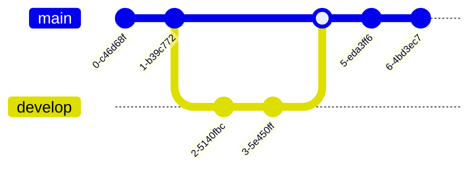

---
# Metadata about the presentation:
title: Slidesdown
author: Jan Christoph Ebersbach
date: 2023-01-20
keywords: slides slideshow slidesdown presentation presentations markup markdown revealjs fontawesome pdf

# Presentation settings:
# URL to favicon
favicon: /favicon.svg
# Theme, list of supported themes: https://github.com/slidesdown/slidesdown/tree/main/docs/reveal.js/dist/theme
theme: white
# Code highlighting theme, list of supported themes: https://github.com/slidesdown/slidesdown/tree/main/docs/reveal.js/plugin/highlight
highlight-theme: tokyo-night-dark
# Load font awesome pro icons (only works on domain slidesdown.github.io) free icons work everywhere. If both are enabled the pro icons are loaded
fontawesomePro: true
fontawesomeFree: false

# Show progress bar
progress: true
# Show controls
controls: true
# Center presentation
center: true
# Create separate pages for fragments
pdfSeparateFragments: false
# Full list of supported settings: https://revealjs.com/config/ or
# https://github.com/hakimel/reveal.js/blob/master/js/config.js
---

#  Slidesdown

> Slideshows as fast as you can type. <small>Created by
> <a href="mailto:jceb@e-jc.de">Jan Christoph Ebersbach</a> and powered by
> <a href="https://revealjs.com/">reveal.js</a></small>

## Hi!

Slidesdown makes it simple to quickly turn an idea into a beautiful
presentation. A [Markdown file](https://slidesdown.github.io/learn.html) is all
you need!

<!-- generated with
!deno run --unstable --allow-read --allow-write https://deno.land/x/remark_format_cli@v0.1.0/remark-format.js --maxdepth 2 %
-->

## Agenda

1. [Introduction](#introduction)
2. [See for yourself..](#see-for-yourself)
3. [Basics](#basics)
4. [Layouts](#layouts)
5. [Animations](#animations)
6. [Backgrounds](#backgrounds)
7. [Pictures and Icons](#pictures-and-icons)
8. [Advanced Formatting](#advanced-formatting)
9. [Charts: ChartJS](#charts-chartjs)
10. [Charts: ApexCharts](#charts-apexcharts)
11. [Diagrams](#diagrams)

## Introduction

### Features

- Setup: No installation
- Focus: Just write Markdown
- Sharable: [Create links](https://slidesdown.github.io/loader.html) to your
  slides
- Offline First:
  [CLI avaiable](https://github.com/slidesdown/slidesdown/blob/main/README.md)
  for offline presentations
- Professional: PDF export and Custom Themes
- Versionable: Store all files in `git`
- Charts and Diagrams: via [chart.js](https://www.chartjs.org/) and
  [mermaid.js](https://mermaid.js.org/)

### Learn how it works

<!-- - [Introduction video to slidesdown](https://youtu.be/ZNXvQGsk_wA) -->

- [Guide to Slidesdown](https://slidesdown.github.io/learn.html)
- Learn by example from other
  [presentations](https://github.com/slidesdown/slidesdown/blob/main/examples)

### Keyboard Shortcuts

- `<Space>` advances to next slide
- `<Shift-Space>` goes to previous slide
- `<f>` enters full-screen mode
- `<s>` shows speaker notes
- `<.>` pauses slideshow
- `<e>` toggles print view
- `<Esc>` toggles slide overview
- `<Alt-Left Mouse Button>` or `<Ctrl-Left Mouse Button>` zooms into slide

### Draw on Slides


### Open Blackboard


## See for yourself..

## Basics

### Headings

<columns-2>

<div>
  <h1>h1</h1>
  <h2>h2</h2>
  <h3>h3</h3>
</div>

```markdown
<!-- please ignore the leading \ -->

\ # h1

\ ## h2

\ ### h3
```

</columns-2>

|||

<grid-box styles="grid-template: 'left' 'code' / 1fr">

Slide without heading.

<!-- .element: style="grid-area: left;" -->

```markdown
<!-- please ignore the leading \ -->
<!-- Horizontal slide -->

\ ---

content

<!-- Vertical slide -->

\ ||| content
```

<!-- .element: style="grid-area: code;" -->

</grid-box>

### Next comes a hidden slide

<grid-box styles="grid-template: 'left' 'code' / 1fr">

Can you see it?

<!-- .element: style="grid-area: left;" -->

```markdown
<!-- please ignore the leading \ -->

\ ### Hidden slide

<!-- .slide: data-visibility="hidden" -->
```

<!-- .element: style="grid-area: code;" -->

</grid-box>

### Hidden slide

<!-- .slide: data-visibility="hidden" -->

### Text formatting

<grid-box styles="grid-template: 'left' 'code' / 1fr">

Regluar, _italic_, **bold**, and <u>underlined</u>.

<!-- .element: style="grid-area: left;" -->

```markdown
Regluar, _italic_, **bold**, and <u>underlined</u>.
```

<!-- .element: style="grid-area: code;" -->

</grid-box>

### Gradient Text

<!-- .element: style="background: linear-gradient(to right, #fc5c7d, #6a82fb); -webkit-background-clip: text; -webkit-text-fill-color: transparent;" -->

```markdown
<!-- please ignore the leading \ -->

\ ### Gradient Text Color

<!-- .element: style="background: linear-gradient(to right, #fc5c7d, #6a82fb); -webkit-background-clip: text; -webkit-text-fill-color: transparent;" -->
```

### Unordered List

<grid-box styles="grid-template: 'left' 'code' / 1fr">

- Item 1
- Item 2
- Item 3

<!-- .element: style="grid-area: left;" -->

```markdown
- Item 1
- Item 2
- Item 3
```

<!-- .element: style="grid-area: code;" -->

</grid-box>

### Ordered List

<grid-box styles="grid-template: 'left' 'code' / 1fr">

1. Item 1
2. Item 2
3. Item 3

<!-- .element: style="grid-area: left;" -->

```markdown
1. Item 1
2. Item 2
3. Item 3
```

<!-- .element: style="grid-area: code;" -->

</grid-box>

### Links

<grid-box styles="grid-template: 'left right' 'code code' / 1fr 1fr">

[Text link](https://github.com/slidesdown/slidesdown)

<!-- .element: style="grid-area: left;" -->

<v-box  style="grid-area: right;">
<figure>

[ <!-- .element: style="width: 30%" -->](https://unsplash.com/photos/x9yfTxHpj5w)

<figcaption>Picture link</figcaption>
</figure>
</v-box>

```markdown
[Text link](https://github.com/slidesdown/slidesdown)

Picture link

[](https://...)
```

<!-- .element: style="grid-area: code;" -->

</grid-box>

### Quotes

<grid-box styles="grid-template: 'left' 'code' / 1fr">

> A famous quote

<!-- .element: style="grid-area: left;" -->

```markdown
> A famous quote
```

<!-- .element: style="grid-area: code;" -->

</grid-box>

### Code Highlighting

<grid-box styles="grid-template: 'left' 'code' / 1fr">

```javascript
function hello(msg) {
  alert(`Hello ${msg}`);
}

hello("world!");
```

<!-- .element: style="grid-area: left;" -->

````markdown
```javascript
function hello(msg) {
  alert(`Hello ${msg}`);
}

hello("world!");
```
````

<!-- .element: style="grid-area: code;" -->

</grid-box>

### Code Highlighting with highlighted Line

<grid-box styles="grid-template: 'left' 'code' / 1fr">

```javascript[2]
function hello(msg) {
  alert(`Hello ${msg}`);
}

hello("world!");
```

<!-- .element: style="grid-area: left;" -->

````markdown
```javascript[2]
function hello(msg) {
  alert(`Hello ${msg}`);
}

hello("world!");
```
````

<!-- .element: style="grid-area: code;" -->

</grid-box>

### Math formulas

<grid-box styles="grid-template: 'left' 'code' / 1fr">

<article>

`$$ \sum_{n=1}^{\infty}\frac{1}{n^2}=\frac{\pi^2}{6} $$`

`$$ e^{\pi i}=-1 $$`

</article>
<!-- .element: style="grid-area: left;" -->

```markdown
`$$ \sum_{n=1}^{\infty}\frac{1}{n^2}=\frac{\pi^2}{6} $$`

`$$ e^{\pi i}=-1 $$`
```

<!-- .element: style="grid-area: code;" -->

</grid-box>

### Table

<grid-box styles="grid-template: 'left' 'code' / 1fr">

| Tables        |      Are      |  Cool |
| ------------- | :-----------: | ----: |
| column 3 is   | right-aligned | $1600 |
| column 2 is   |   centered    |   $12 |
| zebra stripes |   are neat    |    $1 |

<!-- .element: style="grid-area: left;" -->

```markdown
| Tables        |      Are      |  Cool |
| ------------- | :-----------: | ----: |
| column 3 is   | right-aligned | $1600 |
| column 2 is   |   centered    |   $12 |
| zebra stripes |   are neat    |    $1 |
```

<!-- .element: style="grid-area: code;" -->

</grid-box>

## Layouts

### 1 Column

<grid-box styles="grid-template: 'left code' / 2fr 3fr">

<article>
<v-box>
Shopping List

- Bread
- Milk
- Butter

</v-box>

<v-box>
Task List

- Sleep
- Eat
- Work

</v-box>

<v-box>
Bucket List

- ...

</v-box>
</article>

<!-- .element: style="grid-area: left;" -->

```markdown
<v-box>
Shopping List

- Bread
- Milk
- Butter

</v-box>

<v-box>
Task List

- Sleep
- Eat
- Work

</v-box>

<v-box>
Bucket List

- ...

</v-box>
```

<!-- .element: style="grid-area: code;" -->

</grid-box>

### 2 Columns

<grid-box styles="grid-template: 'left code' / 3fr 2fr">

<article>
<columns-2>
<v-box>
Shopping List

- Bread
- Milk
- Butter

</v-box>

<v-box>
Task List

- Sleep
- Eat
- Work

</v-box>

<v-box>
Bucket List

- ...

</v-box>
</columns-2>
</article>
<!-- .element: style="grid-area: left;" -->

```markdown
<columns-2>
<v-box>
Shopping List

- Bread
- Milk
- Butter

</v-box>

<v-box>
Task List

- Sleep
- Eat
- Work

</v-box>

<v-box>
Bucket List

- ...

</v-box>
</columns-2>
```

<!-- .element: style="grid-area: code;" -->

</grid-box>

### 3 Columns

<grid-box styles="grid-template: 'left' 'code' / 1fr">

<columns-3>
<v-box>
Shopping List

- Bread
- Milk
- Butter

</v-box>

<v-box>
Task List

- Sleep
- Eat
- Work

</v-box>

<v-box>
Bucket List

- NYC
- Tokyo
- Singapore

</v-box>
</columns-3>
<!-- .element: style="grid-area: left;" -->

```markdown
<columns-3>
...
</columns-3>
```

<!-- .element: style="grid-area: code;" -->

</grid-box>

### Complex

<grid-box styles="grid-template: 'left code' / 50% 50%">
<grid-box styles="grid-template: 'header header header' 'sidebar main main' / 40% 60%">

<v-box style="grid-area: header; background-color: green">
Shopping List

- Bread
- Milk
- Butter

</v-box>

<v-box style="grid-area:sidebar; background-color: blue">
Task List

- Sleep
- Eat
- Work

</v-box>

<v-box style="grid-area: main; background-color: red">
Bucket List

- NYC
- Tokyo
- Singapore

</v-box>
</grid-box>
<!-- .element: style="grid-area: left;" -->

```markdown
<grid-box styles="grid-template: 'header header header' 'sidebar main main' / 300px auto">

<v-box style="grid-area: header; background-color: green">
Shopping List

- Bread
- Milk
- Butter

</v-box>

<v-box style="grid-area:sidebar; background-color: blue">
Task List

- Sleep
- Eat
- Work

</v-box>

<v-box style="grid-area: main; background-color: red">
Bucket List

- NYC
- Tokyo
- Singapore

</v-box>
</grid-box>
```

<!-- .element: style="grid-area: code;" -->

</grid-box>

## Animations

### Incremental Lists

<grid-box styles="grid-template: 'left' 'code' / 1fr">

- Item 1 <!-- .element: class="fragment" -->
- Item 2 <!-- .element: class="fragment" -->
- Item 3 <!-- .element: class="fragment" -->

<!-- .element: style="grid-area: left;" -->

```markdown
- Item 1 <!-- .element: class="fragment" -->
- Item 2 <!-- .element: class="fragment" -->
- Item 3 <!-- .element: class="fragment" -->
```

</grid-box>

### Fragments

<grid-box styles="grid-template: 'left' 'code' / 1fr">
<columns-2 styles="justify-items: center">
<div>
  
</div>
<div>
  
</div>
<!-- .element: class="fragment" -->
</columns-2>
<!-- .element: style="grid-area: left;" -->

```markdown
<columns-2 styles="justify-items: center">


<!-- .element: class="fragment" -->
</columns-2>
```

<!-- .element: style="grid-area: code;" -->

</grid-box>

### Animated List

<grid-box styles="grid-template: 'left' 'code' / 1fr">

<!-- .slide: data-auto-animate="1" -->

- Item 1
- Item 3
- Item 4

```markdown
<!-- .slide: data-auto-animate="1" -->

- Item 1
- Item 3
- Item 4
```

<!-- .element: style="grid-area: code;" -->

</grid-box>

### Animated List

<grid-box styles="grid-template: 'left' 'code' / 1fr">

<!-- .slide: data-auto-animate="1" -->

- Item 1
- Item 2
- Item 3
- Item 4

```markdown
<!-- .slide: data-auto-animate="1" -->

- Item 1
- Item 2
- Item 3
- Item 4
```

<!-- .element: style="grid-area: code;" -->

</grid-box>

### Animated Colored Boxes

<!-- .slide: data-auto-animate="1" -->

<grid-box styles="grid-template: 'left' 'code' / 100%">

<columns-3 styles="justify-items: center">
<div data-id="1" class="wh-8rem r-10p" style="background-color: lightblue; color: yellow">App 1</div>
<div data-id="2" class="wh-10rem r-20p" style="background-color: pink; color: darkred;">App 2</div>
<div data-id="3" class="wh-12rem r-50p" style="background-color: lightgreen; color: darkgreen;">Circle</div>
</columns-3>
<!-- .element: style="grid-area: left;" -->

```markdown
<!-- .slide: data-auto-animate="1" -->

<columns-3 styles="justify-items: center">
<div data-id="1" class="wh-8rem r-10p" style="background-color: lightblue; color: yellow">App 1</div>
<div data-id="2" class="wh-10rem r-20p" style="background-color: pink; color: darkred;">App 2</div>
<div data-id="3" class="wh-12rem r-50p" style="background-color: lightgreen; color: darkgreen;">Circle</div>
</columns-3>
```

<!-- .element: style="grid-area: code;" -->

</grid-box>

### Animated Colored Boxes

<!-- .slide: data-auto-animate="1" -->

<grid-box styles="grid-template: 'left' 'code' / 100%">

<columns-3 styles="justify-items: center">
<div data-id="3" class="wh-12rem r-50p" style="background-color: lightgreen; color: darkgreen;">Circle</div>
<div data-id="2" class="wh-10rem r-20p" style="background-color: pink; color: darkred;">App 2</div>
<div data-id="1" class="wh-8rem r-10p" style="background-color: lightblue; color: yellow">App 1</div>
</columns-3>
<!-- .element: style="grid-area: left;" -->

```markdown
<!-- .slide: data-auto-animate="1" -->

<columns-3 styles="justify-items: center">
<div data-id="3" class="wh-12rem r-50p" style="background-color: lightgreen; color: darkgreen;">Circle</div>
<div data-id="2" class="wh-10rem r-20p" style="background-color: pink; color: darkred;">App 2</div>
<div data-id="1" class="wh-8rem r-10p" style="background-color: lightblue; color: yellow">App 1</div>
</columns-3>
```

<!-- .element: style="grid-area: code;" -->

</grid-box>

## Backgrounds

### Colored background

<!-- .slide: data-background-color="#78a5e9" -->

```markdown
<!-- .slide: data-background-color="#78a5e9" -->
```

### Gradient background

<!-- .slide: data-background-gradient="linear-gradient(#e66465, #9198e5)" -->

```markdown
<!-- .slide: data-background-gradient="linear-gradient(#e66465, #9198e5)" -->
```

### Background image

<!-- .slide: data-background-image="https://images.unsplash.com/photo-1499892477393-f675706cbe6e?ixlib=rb-1.2.1\&q=80\&fm=jpg\&crop=entropy\&cs=tinysrgb\&w=640" -->

```markdown
<!-- .slide: data-background-image="https://..." -->
```

## Pictures and Icons

### Picture

<grid-box styles="grid-template: 'left' 'code' / 1fr">


<!-- .element: style="grid-area: left;" -->

```markdown

```

<!-- .element: style="grid-area: code;" -->

</grid-box>

### Framed Picture

<grid-box styles="grid-template: 'left' 'code' / 1fr">

<div style="display: flex; justify-content: center; grid-area: left;">


<!-- .element: class="r-frame" style="height: 30%; width: 30%"  -->

</div>

```markdown


<!-- .element: class="r-frame" -->
```

<!-- .element: style="grid-area: code;" -->

</grid-box>

### Font Awesome Icon

<i class="fa-solid fa-face-smile"></i>

```markdown
<i class="fa-solid fa-face-smile"></i>
```

### Font Awesome Icon with Color

<span style="font-size: 8rem; color: purple;">
<i class="fa-solid fa-face-smile"></i>
</span>

```markdown
<span style="font-size: 8rem; color: purple;">
<i class="fa-solid fa-face-smile"></i>
</span>
```

### Font Awesome Stacked Icons

<grid-box styles="grid-template: 'left' 'code' / 1fr">
<columns-2 styles="justify-items: center; grid-area: left;">
<div class="fa-stack fa-2x">
<i class="fas fa-circle fa-stack-2x"></i>
<i class="fas fa-flag fa-stack-1x fa-inverse"></i>
</div>

<div class="fa-stack fa-2x">
<i class="fas fa-camera fa-stack-1x"></i>
<i class="fas fa-ban fa-stack-2x" style="color:Tomato"></i>
</div>
</columns-2>

```markdown
<columns-2 styles="justify-items: center;">
<div class="fa-stack fa-2x">
<i class="fas fa-circle fa-stack-2x"></i>
<i class="fas fa-flag fa-stack-1x fa-inverse"></i>
</div>

<div class="fa-stack fa-2x">
<i class="fas fa-camera fa-stack-1x"></i>
<i class="fas fa-ban fa-stack-2x" style="color:Tomato"></i>
</div>
</columns-2>
```

<!-- .element: style="grid-area: code;" -->

</grid-box>

### FontAwesome Bullet Icons

<grid-box styles="grid-template: 'left' 'code' / 100%; justify-items: center">
<ul class="fa-ul" style="list-style-type: none; grid-area: left;">
  <li><span class="fa-li c-primary"><i class="fad fa-badge-check"></i></span> Regular bullet icon</li>
  <li><span class="fa-li c-primary"><i class="fad fa-recycle"></i></span> Regular bullet icon</li>
  <li><span class="fa-li" style="font-size: 0.7em; left: -2.5em;">
    <span class="fa-stack c-primary">
    <i class="fad fa-digging fa-stack-1x"></i>
    <i class="fas fa-ban fa-stack-2x" style="color: Tomato; opacity: 0.8;"></i>
    </span>
    </span> Stacked bullet icon</li>
</ul>

```markdown
<ul class="fa-ul" style="list-style-type: none;">
<li><span class="fa-li c-primary"><i class="fad fa-badge-check"></i></span> ...</li>
<li><span class="fa-li c-primary"><i class="fad fa-recycle"></i></span> ...</li>
<li><span class="fa-li" style="font-size: 0.7em; left: -2.5em;">
<span class="fa-stack c-primary">
<i class="fad fa-digging fa-stack-1x"></i>
<i class="fas fa-ban fa-stack-2x" style="color: Tomato; opacity: 0.8;"></i>
</span>
</span> Stacked bullet icon</li>
</ul>
```

<!-- .element: style="grid-area: code;" -->

</grid-box>

## Advanced Formatting

### Colored <span style="color: #78a5e9">text</span>

```markdown
Colored <span style="color: #78a5e9">text</span>
```

### Box Shadow

<grid-box styles="grid-template: 'left' 'code' / 100%; justify-items: center">

<columns-2 styles="grid-area: main">

<span class="s-trbl">
Shadow top, right, bottom, left.
</span>

<span class="s-rbl">
Shadow right, bottom, left.
</span>

<span class="s-rb">
Shadow right, bottom.
</span>

<span class="s-bl">
    Shadow bottom, left.
</span>

</columns-2>

```markdown
<span class="s-trbl">Shadow top, right, bottom, left.</span>
<span class="s-rbl">Shadow right, bottom, left.</span>
<span class="s-rb">Shadow right, bottom.</span>
<span class="s-bl">Shadow bottom, left.</span>
```

<!-- .element: style="grid-area: code;" -->

</grid-box>

### Colored Boxes

<grid-box styles="grid-template: 'left' 'code' / 100%">

<columns-3 styles="justify-items: center">
<div data-id="1" class="wh-8rem r-10p" style="background-color: lightblue; color: yellow">App 1</div>
<div data-id="2" class="wh-10rem r-20p" style="background-color: pink; color: darkred;">App 2</div>
<div data-id="3" class="wh-12rem r-50p" style="background-color: lightgreen; color: darkgreen;">Circle</div>
</columns-3>
<!-- .element: style="grid-area: left;" -->

```markdown
<columns-3 styles="justify-items: center">
<div data-id="1" class="wh-8rem r-10p" style="background-color: lightblue; color: yellow">App 1</div>
<div data-id="2" class="wh-10rem r-20p" style="background-color: pink; color: darkred;">App 2</div>
<div data-id="3" class="wh-12rem r-50p" style="background-color: lightgreen; color: darkgreen;">Circle</div>
</columns-3>
```

<!-- .element: style="grid-area: code;" -->

</grid-box>

### Font Awesome Buttons

<grid-box styles="grid-template: 'left' 'code' / 100%">

<columns-3 styles="justify-items: center">
<div class="flex a-center j-around wh-8rem r-10p s-trbl" style="background-color: lightblue; color: yellow"><i class="fas fa-thumbs-up"></i></div>
<div class="fs-4 flex a-center j-around wh-10rem r-20p s-rbl" style="background-color: pink; color: darkred;"><i class="fas fa-thumbtack"></i></div>
<div class="fs-7 flex a-center j-around wh-12rem r-50p s-rb" style="background-color: lightgreen; color: darkgreen;"><i class="fas fa-headphones"></i></div>
</columns-3>
<!-- .element: style="grid-area: left;" -->

```markdown
<columns-3 styles="justify-items: center">
<div class="flex a-center j-around wh-8rem r-10p s-trbl" style="background-color: lightblue; color: yellow"><i class="fas fa-thumbs-up"></i></div>
<div class="fs-4 flex a-center j-around wh-10rem r-20p s-rbl" style="background-color: pink; color: darkred;"><i class="fas fa-thumbtack"></i></div>
<div class="fs-7 flex a-center j-around wh-12rem r-50p s-rb" style="background-color: lightgreen; color: darkgreen;"><i class="fas fa-headphones"></i></div>
</columns-3>
```

<!-- .element: style="grid-area: code;" -->

</grid-box>

### Picture Buttons

<grid-box styles="grid-template: 'left' 'code' / 100%">

<columns-4>
<div class="wh-8rem r-10p overflow-hidden background-cover s-trbl" style='background-image: url("https://images.unsplash.com/photo-1595537725181-0f127e2feeb2?ixlib=rb-1.2.1&q=80&fm=jpg&crop=entropy&cs=tinysrgb&w=640");'></div>
<div class="wh-10rem r-20p overflow-hidden background-cover s-rbl" style='background-image: url("https://images.unsplash.com/photo-1595589982168-77b64bc1b485?ixlib=rb-1.2.1&q=80&fm=jpg&crop=entropy&cs=tinysrgb&w=640");'></div>
<div class="wh-12rem r-30p overflow-hidden background-cover s-rb" style='background-image: url("https://images.unsplash.com/photo-1595586964632-b215dfbc064a?ixlib=rb-1.2.1&q=80&fm=jpg&crop=entropy&cs=tinysrgb&w=640");'></div>
<div class="wh-14rem r-50p overflow-hidden background-cover s-bl" style='background-image: url("https://images.unsplash.com/photo-1595508064774-5ff825ff0f81?ixlib=rb-1.2.1&q=80&fm=jpg&crop=entropy&cs=tinysrgb&w=640");'></div>
</columns-4>
<!-- .element: style="grid-area: left;" -->

```markdown
<columns-4>
<div class="wh-8rem r-10p overflow-hidden background-cover s-trbl" style='background-image: url("https://...");'></div>
<div class="wh-10rem r-20p overflow-hidden background-cover s-rbl" style='background-image: url("https://...");'></div>
<div class="wh-12rem r-30p overflow-hidden background-cover s-rb" style='background-image: url("https://...");'></div>
<div class="wh-14rem r-50p overflow-hidden background-cover s-bl" style='background-image: url("https://...");'></div>
</columns-4>
```

<!-- .element: style="grid-area: code;" -->

</grid-box>

## Charts: ChartJS

via [chart.js](https://www.chartjs.org/)

### Polar Area Chart

<grid-box styles="grid-template: 'left code' / 50% 50%;">

```chartjs
{
  "type": "polarArea",
  "data": {
    "labels": [
      "Red",
      "Green",
      "Yellow",
      "Grey",
      "Blue"
    ],
    "datasets": [
      {
        "label": "My First Dataset",
        "data": [
          11,
          16,
          7,
          3,
          14
        ],
        "backgroundColor": [
          "rgb(255, 99, 132)",
          "rgb(75, 192, 192)",
          "rgb(255, 205, 86)",
          "rgb(201, 203, 207)",
          "rgb(54, 162, 235)"
        ]
      }
    ]
  }
}
```

<!-- .element: style="grid-area: left; height: 300px;" -->

````json
```chartjs
{
  "type": "polarArea",
  "data": {
    "labels": [
      "Red",
      ...
    ],
    "datasets": [
      {
        "label": "My First Dataset",
        "data": [
          11,
          ...
        ],
        "backgroundColor": [
          "rgb(255, 99, 132)",
          ...
        ]
      }
    ]
  }
}
```
````

<!-- .element: style="grid-area: code;" -->

</grid-box>

### Line Chart

<grid-box styles="grid-template: 'left code' / 50% 50%;">

```chartjs
{
  "type": "line",
  "data": {
   "labels": ["January","February","March","April","May","June","July"],
   "datasets":[
    {
     "data":[65,59,80,81,56,55,40],
     "label":"My first dataset","backgroundColor":"rgba(20,220,220,.8)"
    },
    {
     "data":[28,48,40,19,86,27,90],
     "label":"My second dataset","backgroundColor":"rgba(220,120,120,.8)"
    }
   ]
  }
}
```

<!-- .element: style="grid-area: left;" -->

````json
```chartjs
{
  "type": "line",
  "data": {
   "labels": ["January","February","March","April","May","June","July"],
   "datasets":[
    {
     "data":[65,59,80,81,56,55,40],
     "label":"My first dataset","backgroundColor":"rgba(20,220,220,.8)"
    },
    {
     "data":[28,48,40,19,86,27,90],
     "label":"My second dataset","backgroundColor":"rgba(220,120,120,.8)"
    }
   ]
  }
}
```
````

<!-- .element: style="grid-area: code;" -->
</grid-box>

### Bar Chart

<grid-box styles="grid-template: 'left code' / 50% 50%;">

```chartjs
{
  "type": "bar",
  "data": {
    "labels": [
      "January",
      "February",
      "March",
      "April",
      "May",
      "June",
      "July"
    ],
    "datasets": [
      {
        "label": "My First Dataset",
        "data": [
          65,
          59,
          80,
          81,
          56,
          55,
          40
        ],
        "borderWidth": 1
      }
    ]
  }
}
```

<!-- .element: style="grid-area: left;" -->

````json
```chartjs
{
  "type": "bar",
  "data": {
    "labels": [
      "January",
      ...
    ],
    "datasets": [
      {
        "label": "My First Dataset",
        "data": [
          65,
          ...
        ],
        "borderWidth": 1
      }
    ]
  }
}
```
````

<!-- .element: style="grid-area: code;" -->

</grid-box>

### Radar chart

<!-- WARNING: man, sometimes these charts go crazy - this chart's height is 1024, so make it half -->

<grid-box styles="grid-template: 'left code' 512px / 50% 50%;">

```chartjs
{
  "type": "radar",
  "data": {
    "labels": [
      "Eating",
      "Drinking",
      "Sleeping",
      "Designing",
      "Coding",
      "Cycling",
      "Running"
    ],
    "datasets": [
      {
        "label": "My First Dataset",
        "data": [
          65,
          59,
          90,
          81,
          56,
          55,
          40
        ],
        "fill": true,
        "backgroundColor": "rgba(255, 99, 132, 0.2)",
        "borderColor": "rgb(255, 99, 132)",
        "pointBackgroundColor": "rgb(255, 99, 132)",
        "pointBorderColor": "#fff",
        "pointHoverBackgroundColor": "#fff",
        "pointHoverBorderColor": "rgb(255, 99, 132)"
      },
      {
        "label": "My Second Dataset",
        "data": [
          28,
          48,
          40,
          19,
          96,
          27,
          100
        ],
        "fill": true,
        "backgroundColor": "rgba(54, 162, 235, 0.2)",
        "borderColor": "rgb(54, 162, 235)",
        "pointBackgroundColor": "rgb(54, 162, 235)",
        "pointBorderColor": "#fff",
        "pointHoverBackgroundColor": "#fff",
        "pointHoverBorderColor": "rgb(54, 162, 235)"
      }
    ]
  }
}
```

<!-- .element: style="grid-area: left;" -->

````json
```chartjs
{
  "type": "radar",
  "data": {
    "labels": [
      "Eating",
      ...
    ],
    "datasets": [
      {
        "label": "My First Dataset",
        "data": [
          65,
          ...
        ],
        "fill": true,
        ...
      },
      {
        "label": "My Second Dataset",
        "data": [
          28,
          ...
        ],
        "fill": true,
        ...
      }
    ]
  }
}
```
````

<!-- .element: style="grid-area: code;" -->

</grid-box>

## Charts: ApexCharts

via [apexcharts](https://apexcharts.com/)

### Line Chart

<grid-box styles="grid-template: 'left code' / 50% 50%;">

```apexchart
{
  "chart": {
    "type": "line"
  },
  "series": [{
    "name": "sales",
    "data": [30,40,35,50,49,60,70,91,125]
  }],
  "xaxis": {
    "categories": [1991,1992,1993,1994,1995,1996,1997, 1998,1999]
  }
}
```

<!-- .element: style="grid-area: left;" -->

````markdown
```apexchart
{
  "chart": {
    "type": "line"
  },
  "series": [{
    "name": "sales",
    "data": [30,40,35,50,49,60,70,91,125]
  }],
  "xaxis": {
    "categories": [1991,1992,1993,1994,1995,1996,1997, 1998,1999]
  }
}
```
````

<!-- .element: style="grid-area: code;" -->

</grid-box>

### More Examples

see [docs](https://apexcharts.com/docs/chart-types/line-chart/)

## Diagrams

via [mermaid.js](https://mermaid.js.org/)

### Flowchart

<grid-box styles="grid-template: 'left code' / 50% 50%;">


<!-- .element: style="grid-area: left;" -->

````markdown

````

<!-- .element: style="grid-area: code;" -->

</grid-box>

### Flowchart Complex

<grid-box styles="grid-template: 'left code' 80% / 50% 50%;">


<!-- .element: style="grid-area: left; height: 500px" -->

````markdown

````

<!-- .element: style="grid-area: code;" -->

</grid-box>

### Sequence Diagram

<grid-box styles="grid-template: 'left code' / 50% 50%;">


<!-- .element: style="grid-area: left;" -->

````markdown

````

<!-- .element: style="grid-area: code;" -->

</grid-box>

### State Diagram

<!-- WARNING: man, sometimes these charts go crazy - this chart's height is 1024, so make it half -->

<grid-box styles="grid-template: 'left code' 512px / 50% 50%;">


<!-- .element: style="grid-area: left; height: 80%" -->

````markdown

````

<!-- .element: style="grid-area: code;" -->

</grid-box>

### Entity Relationship Diagram

<grid-box styles="grid-template: 'left code' / 50% 50%;">


<!-- .element: style="grid-area: left;" -->

````markdown

````

<!-- .element: style="grid-area: code;" -->

</grid-box>

### User Journey Diagram

<grid-box styles="grid-template: 'left code' / 50% 50%;">


<!-- .element: style="grid-area: left; height: 300px;" -->

````markdown

````

<!-- .element: style="grid-area: code;" -->

</grid-box>

### Gantt Chart

<grid-box styles="grid-template: 'left' 'code' / 100%;">


<!-- .element: style="grid-area: left;" -->

````markdown

````

<!-- .element: style="grid-area: code;" -->

</grid-box>

### Git Graph

<grid-box styles="grid-template: 'left code' / 50% 50%;">


<!-- .element: style="grid-area: left;" -->

````markdown

````

<!-- .element: style="grid-area: code;" -->

</grid-box>

---

<h1>Thank you</h1>

<h2>for using <a href="https://github.com/slidesdown/slidesdown">Slidesdown</a></h2>
