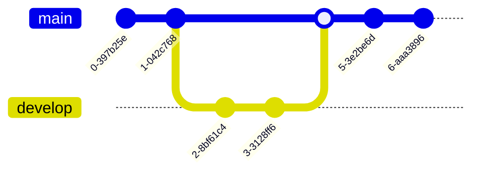

---
# Metadata
author: Jan Christoph Ebersbach
date: 2023-01-20
title: slidesdown
keywords: slides slideshow slidesdown presentation presentations markup markdown revealjs fontawesome pdf
favicon: /favicon.svg
theme: white
highlight-theme: tokyo-night-dark

# show presentation progress bar
progress: true
# show controls
controls: true
# center presentation
center: true
# Full list of supported settings: https://revealjs.com/config/
---

#  slidesdown

> Slideshows as fast as you can type Markdown.

<!-- generated with
!deno run --unstable --allow-read --allow-write https://deno.land/x/remark_format_cli@v0.1.0/remark-format.js --maxdepth 2 %
-->

## Agenda

1. [Introduction](#introduction)
2. [See for yourself..](#see-for-yourself)
3. [Basics](#basics)
4. [Layouts](#layouts)
5. [Animations](#animations)
6. [Backgrounds](#backgrounds)
7. [Pictures and Icons](#pictures-and-icons)
8. [Advanced Formatting](#advanced-formatting)
9. [Charts](#charts)
10. [Diagrams](#diagrams)

## Introduction

### Slidesdown

Slidesdown makes it simple to quickly turning an idea into a beautiful
presentation. A [Markdown file](https://slidesdown.e-jc.de/learn.html) is all
you need!

### Features

- Setup: No installation
- Focus: Just write Markdown
- Sharable: [Create links](https://slidesdown.e-jc.de/loader.html) to your
  presentations
- Professional: PDF export and Custom Themes
- Styling: Looks great out of the box
- Versioning: Store all files in `git`
- Charts and Diagrams: via [chart.js](https://www.chartjs.org/) and
  [mermaid.js](https://mermaid.js.org/)
- Reliable: Built with [reveal.js](https://revealjs.com/)

### Keyboard Shortcuts

- `<Space>` advance to next slide
- `<Shift-Space>` go to previous slide
- `<f>` enter full-screen mode
- `<s>` show speaker notes
- `<p>` switch between print view and presentation
- `<Esc>` open slides overview, press `<Esc>` to show selected slide
- `<Alt-Left Mouse Button>` or `<Ctrl-Left Mouse Button>` zoom into slide

### Learn how it works

<!-- - [Introduction video to slidesdown](https://youtu.be/ZNXvQGsk_wA) -->

- [Guide to Slidesdown](https://slidesdown.e-jc.de/learn.html)
- Learn by example from this presentation's
  [Markdown file](https://github.com/jceb/slidesdown/blob/main/SLIDES.md)

## See for yourself..

## Basics

### Headings

<h1>h1</h1>
<h2>h2</h2>
<h3>h3</h3>

|||

No heading.

### Next comes a hidden slide

Can you see it?

### Hidden slide

<!-- .slide: data-visibility="hidden" -->

### Text formatting

Regluar, _italic_, **bold**, and <u>underlined</u>.

### Unordered List

- Item 1
- Item 2
- Item 3

### Ordered List

1. Item 1
2. Item 2
3. Item 3

### Links

<column-2>

[Text link](https://github.com/jceb/slidesdown)

<v-box>

Picture link

[](https://unsplash.com/photos/x9yfTxHpj5w)

</v-box>

<!-- .element: class="50p" -->

</column-2>

### Quotes

> A famous quote

### Code Highlighting

```javascript
function hello(msg) {
  alert(`Hello ${msg}`);
}

hello("world!");
```

### Code Highlighting with Line Numbers

```javascript []
function hello(msg) {
  alert(`Hello ${msg}`);
}

hello("world!");
```

### Code Highlighting with highlighted Line

```javascript [2]
function hello(msg) {
  alert(`Hello ${msg}`);
}

hello("world!");
```

### Math formulas

`$$ \sum_{n=1}^{\infty}\frac{1}{n^2}=\frac{\pi^2}{6} $$`

`$$ e^{\pi i}=-1 $$`

### Table

| Tables        |      Are      |  Cool |
| ------------- | :-----------: | ----: |
| column 3 is   | right-aligned | $1600 |
| column 2 is   |   centered    |   $12 |
| zebra stripes |   are neat    |    $1 |

## Layouts

### 1 Column

<v-box>
Shopping List

- Bread
- Milk
- Butter

</v-box>

<v-box>
Task List

- Sleep
- Eat
- Work

</v-box>

<v-box>
Bucket List

- NYC
- Tokyo
- Singapore

</v-box>

### 2 Columns

<column-2>
<v-box>
Shopping List

- Bread
- Milk
- Butter

</v-box>

<v-box>
Task List

- Sleep
- Eat
- Work

</v-box>

<v-box>
Bucket List

- NYC
- Tokyo
- Singapore

</v-box>
</column-2>

### 3 Columns

<column-3>
<v-box>
Shopping List

- Bread
- Milk
- Butter

</v-box>

<v-box>
Task List

- Sleep
- Eat
- Work

</v-box>

<v-box>
Bucket List

- NYC
- Tokyo
- Singapore

</v-box>
</column-3>

### Complex

<grid-box styles="grid-template: 'header header header' 'sidebar main main' / 300px auto">

<v-box style="grid-area: header; background-color: green">
Shopping List

- Bread
- Milk
- Butter

</v-box>

<v-box style="grid-area:sidebar; background-color: blue">
Task List

- Sleep
- Eat
- Work

</v-box>

<v-box style="grid-area: main; background-color: red">
Bucket List

- NYC
- Tokyo
- Singapore

</v-box>
</grid-box>

### Complex Sidebar Right

<grid-box styles="grid-template: 'header header header' 'main main sidebar' / 1fr 1fr 300px">

<v-box style="grid-area: header; background-color: green">
Shopping List

- Bread
- Milk
- Butter

</v-box>

<v-box style="grid-area:sidebar; background-color: blue">
Task List

- Sleep
- Eat
- Work

</v-box>

<v-box style="grid-area: main; background-color: red">
Bucket List

- NYC
- Tokyo
- Singapore

</v-box>

</grid-box>

## Animations

### Incremental Lists

- Item 1 <!-- .element: class="fragment" -->
- Item 2 <!-- .element: class="fragment" -->
- Item 3 <!-- .element: class="fragment" -->

### Fragments

<column-2>


<!-- .element: class="fragment" -->
</column-2>

<div>

### Breaks

- Item 1

<div class="fragment">

- Item 2
- Item 3

<div>

### Animated List

<!-- .slide: data-auto-animate="1" -->

- Item 1
- Item 3
- Item 4

### Animated List

<!-- .slide: data-auto-animate="1" -->

- Item 1
- Item 2
- Item 3
- Item 4

### Animated Colored Boxes

<!-- .slide: data-auto-animate="1" -->

<column-3>
<div data-id="1" class="box-8rem radius-10p" style="background-color: lightblue; color: yellow">App 1</div>
<div data-id="2" class="box-10rem radius-20p" style="background-color: pink; color: darkred;">App 2</div>
<div data-id="3" class="box-12rem radius-50p" style="background-color: lightgreen; color: darkgreen;">Circle</div>
</column-3>

### Animated Colored Boxes

<!-- .slide: data-auto-animate="1" -->

<column-3>
<div data-id="3" class="box-12rem radius-50p" style="background-color: lightgreen; color: darkgreen;">Circle</div>
<div data-id="2" class="box-10rem radius-20p" style="background-color: pink; color: darkred;">App 2</div>
<div data-id="1" class="box-8rem radius-10p" style="background-color: lightblue; color: yellow">App 1</div>
</column-3>

## Backgrounds

### Slide with background image

<!-- .slide: data-background-image="https://images.unsplash.com/photo-1499892477393-f675706cbe6e?ixlib=rb-1.2.1\&q=80\&fm=jpg\&crop=entropy\&cs=tinysrgb\&w=640" -->

### Slide with colored background

<!-- .slide: data-background-color="#78a5e9" -->

## Pictures and Icons

### Picture


### Framed Picture


<!-- .element: class="r-frame" -->

### Font Awesome Icon

<i class="fa-solid fa-face-smile"></i>

### Font Awesome Icon with Color

<span style="font-size: 8rem; color: purple;">
<i class="fa-solid fa-face-smile"></i>
</span>

### Font Awesome Stacked Icons

<div class="display: flex; align-items: center; justify-content: space-around;"
<span class="fa-stack fa-2x">
<i class="fab fa-twitter fa-stack-1x fa-inverse"></i> </span>
<span class="fa-stack fa-2x"> <i class="fas fa-circle fa-stack-2x"></i>
<i class="fas fa-flag fa-stack-1x fa-inverse"></i> </span>
<span class="fa-stack fa-2x"> <i class="fas fa-square-full fa-stack-2x"></i>
<i class="fas fa-terminal fa-stack-1x fa-inverse"></i> </span>
<span class="fa-stack fa-4x"> <i class="fas fa-square fa-stack-2x"></i>
<i class="fas fa-terminal fa-stack-1x fa-inverse"></i> </span>
<span class="fa-stack fa-2x"> <i class="fas fa-camera fa-stack-1x"></i>
<i class="fas fa-ban fa-stack-2x" style="color:Tomato"></i> </span>
</div>

### FontAwesome Bullet Icons

<ul class="fa-ul" style="list-style-type: none;">
  <li><span class="fa-li c-primary"><i class="fad fa-badge-check"></i></span> Regular bullet icon</li>
  <li><span class="fa-li c-primary"><i class="fad fa-recycle"></i></span> Regular bullet icon</li>
  <li><span class="fa-li" style="font-size: 0.7em; left: -2.5em;">
    <span class="fa-stack c-primary">
    <i class="fad fa-digging fa-stack-1x"></i>
    <i class="fas fa-ban fa-stack-2x" style="color: Tomato; opacity: 0.8;"></i>
    </span>
    </span> Stacked bullet icon</li>
</ul>

## Advanced Formatting

### Colored <span style="color: #78a5e9">text</span>

### Box Shadow

<column-2>

<span class="box-shadow-trbl">
Shadow top, right, bottom, left.
</span>

<span class="box-shadow-rbl">
Shadow right, bottom, left.
</span>

<span class="box-shadow-rb">
Shadow right, bottom.
</span>

<span class="box-shadow-bl">
    Shadow bottom, left.
</span>

</column-2>

### Colored Boxes

<column-3>
<div class="box-8rem radius-10p" style="background-color: lightblue; color: yellow">App 1</div>
<div class="box-10rem radius-20p" style="background-color: pink; color: darkred;">App 2</div>
<div class="box-12rem radius-50p" style="background-color: lightgreen; color: darkgreen;">Circle</div>
</column-3>

### Font Awesome Buttons

<column-3>
<div class="flex align-center justify-around box-8rem radius-10p box-shadow-trbl" style=" background-color: lightblue; color: yellow"><i class="fas fa-thumbs-up"></i></div>
<div class="fs-4 flex align-center justify-around box-10rem radius-20p box-shadow-rbl" style=" background-color: pink; color: darkred;"><i class="fas fa-thumbtack"></i></div>
<div class="fs-7 flex align-center justify-around box-12rem radius-50p box-shadow-rb" style=" background-color: lightgreen; color: darkgreen;"><i class="fas fa-headphones"></i></div>
</column-3>

### Picture Buttons

<column-4>
<div class="box-8rem radius-10p overflow-hidden background-cover box-shadow-trbl" style='background-image: url("https://images.unsplash.com/photo-1595537725181-0f127e2feeb2?ixlib=rb-1.2.1&q=80&fm=jpg&crop=entropy&cs=tinysrgb&w=640");'></div>
<div class="box-10rem radius-20p overflow-hidden background-cover box-shadow-rbl" style='background-image: url("https://images.unsplash.com/photo-1595589982168-77b64bc1b485?ixlib=rb-1.2.1&q=80&fm=jpg&crop=entropy&cs=tinysrgb&w=640");'></div>
<div class="box-12rem radius-30p overflow-hidden background-cover box-shadow-rb" style='background-image: url("https://images.unsplash.com/photo-1595586964632-b215dfbc064a?ixlib=rb-1.2.1&q=80&fm=jpg&crop=entropy&cs=tinysrgb&w=640");'></div>
<div class="box-14rem radius-50p overflow-hidden background-cover box-shadow-bl" style='background-image: url("https://images.unsplash.com/photo-1595508064774-5ff825ff0f81?ixlib=rb-1.2.1&q=80&fm=jpg&crop=entropy&cs=tinysrgb&w=640");'></div>
</column-4>

## Charts

via [chart.js](https://www.chartjs.org/)

### Polar Area Chart

<!-- INFO: please mind adding the surrounding div. If not present this bug is triggered: https://github.com/chartjs/Chart.js/issues/5805 -->

<div>
<canvas data-chart="polarArea">
<!--
{
  "data": {
    "labels": [
      "Red",
      "Green",
      "Yellow",
      "Grey",
      "Blue"
    ],
    "datasets": [
      {
        "label": "My First Dataset",
        "data": [
          11,
          16,
          7,
          3,
          14
        ],
        "backgroundColor": [
          "rgb(255, 99, 132)",
          "rgb(75, 192, 192)",
          "rgb(255, 205, 86)",
          "rgb(201, 203, 207)",
          "rgb(54, 162, 235)"
        ]
      }
    ]
  }
}
-->
</canvas>
</div>

### Line Chart

<!-- INFO: please mind adding the surrounding div. If not present this bug is triggered: https://github.com/chartjs/Chart.js/issues/5805 -->

<div>
<canvas data-chart="line">
<!--
{
 "data": {
  "labels": ["January","February","March","April","May","June","July"],
  "datasets":[
   {
    "data":[65,59,80,81,56,55,40],
    "label":"My first dataset","backgroundColor":"rgba(20,220,220,.8)"
   },
   {
    "data":[28,48,40,19,86,27,90],
    "label":"My second dataset","backgroundColor":"rgba(220,120,120,.8)"
   }
  ]
 }
}
-->
</canvas>
</div>

### Bar Chart

<!-- INFO: please mind adding the surrounding div. If not present this bug is triggered: https://github.com/chartjs/Chart.js/issues/5805 -->

<div>
<canvas data-chart="bar">
<!--
{
  "data": {
    "labels": [
      "January",
      "February",
      "March",
      "April",
      "May",
      "June",
      "July"
    ],
    "datasets": [
      {
        "label": "My First Dataset",
        "data": [
          65,
          59,
          80,
          81,
          56,
          55,
          40
        ],
        "borderWidth": 1
      }
    ]
  }
}
-->
</canvas>
</div>

### Radar chart

<!-- INFO: please mind adding the surrounding div. If not present this bug is triggered: https://github.com/chartjs/Chart.js/issues/5805 -->

<div>
<canvas data-chart="radar" style="height: 90%; width: 90%;">
<!--
{
  "data": {
    "labels": [
      "Eating",
      "Drinking",
      "Sleeping",
      "Designing",
      "Coding",
      "Cycling",
      "Running"
    ],
    "datasets": [
      {
        "label": "My First Dataset",
        "data": [
          65,
          59,
          90,
          81,
          56,
          55,
          40
        ],
        "fill": true,
        "backgroundColor": "rgba(255, 99, 132, 0.2)",
        "borderColor": "rgb(255, 99, 132)",
        "pointBackgroundColor": "rgb(255, 99, 132)",
        "pointBorderColor": "#fff",
        "pointHoverBackgroundColor": "#fff",
        "pointHoverBorderColor": "rgb(255, 99, 132)"
      },
      {
        "label": "My Second Dataset",
        "data": [
          28,
          48,
          40,
          19,
          96,
          27,
          100
        ],
        "fill": true,
        "backgroundColor": "rgba(54, 162, 235, 0.2)",
        "borderColor": "rgb(54, 162, 235)",
        "pointBackgroundColor": "rgb(54, 162, 235)",
        "pointBorderColor": "#fff",
        "pointHoverBackgroundColor": "#fff",
        "pointHoverBorderColor": "rgb(54, 162, 235)"
      }
    ]
  }
}
-->
</canvas>
</div>

## Diagrams

via [mermaid.js](https://mermaid.js.org/)

### Flowchart

<column-2>


</column-2>

### Sequence Diagram


### State Diagram


### Entity Relationship Diagram


### User Journey Diagram


### Gantt Chart


### Git Graph



---

<h2>Thank you</h2>

<h3>for using <a href="https://github.com/jceb/slidesdown">slidesdown</a></h3>
